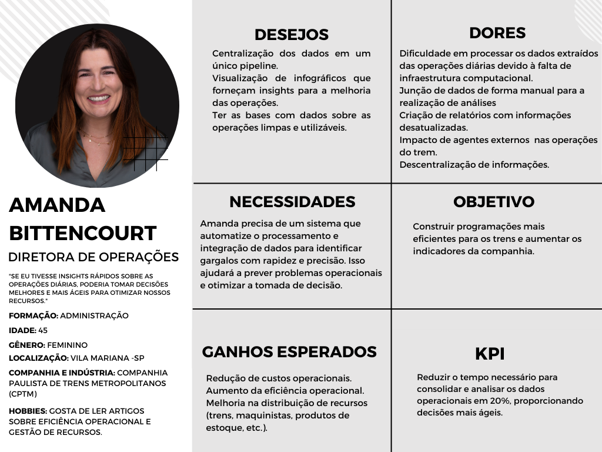
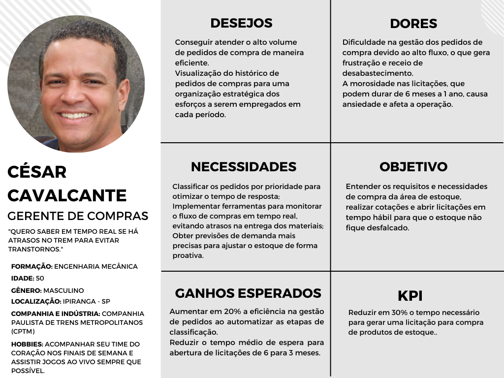
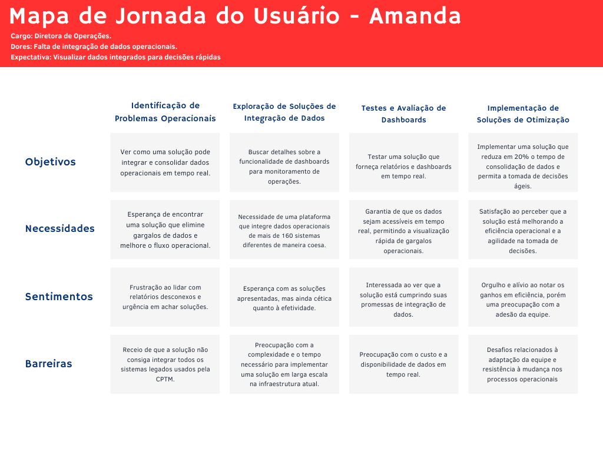
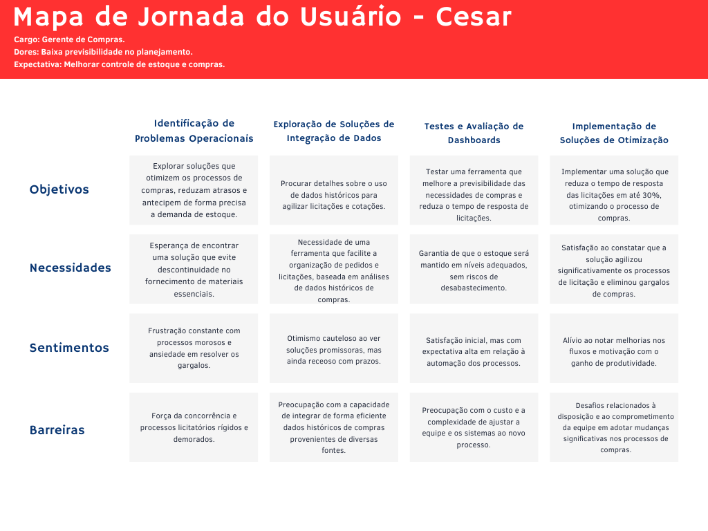
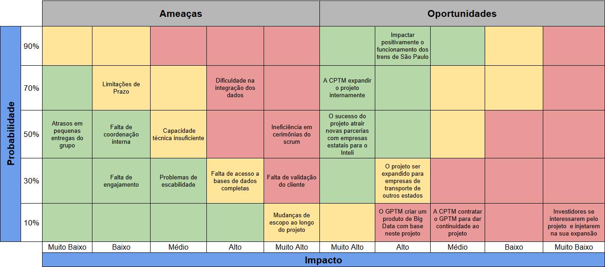
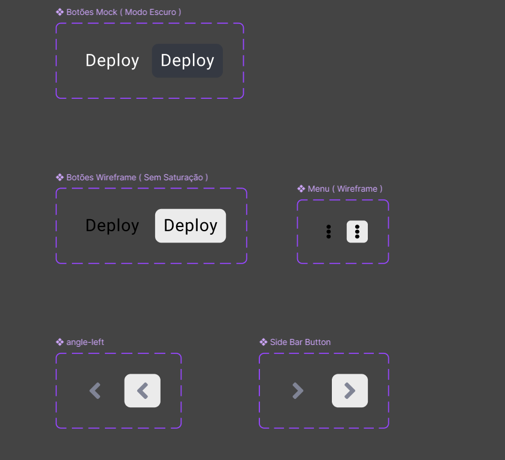
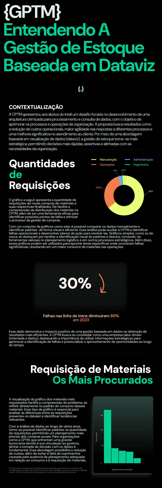

# Documentação do Projeto

## Sumário
- [1. Motivação do Projeto](#1-motivação-do-projeto)
  - [1.1 Visão do Produto](##1.1-visão-do-produto)
  - [1.2 Canvas MVP](##1.2-canvas-mvp)
  - [1.3 Definição: É, Não É, Faz, Não Faz](##1.3-definição:-é,-não-é,-faz,-não-faz)
- [2. Análises de UX](#2-análises-de-ux)
  - [2.1 Personas](#21-personas)
  - [2.2 Mapa de Jornada do Usuário](#22-mapa-de-jornada-do-usuário)
  - [2.3 User Stories](#23-user-stories)
- [3. Análises de Negócios](#3-análises-de-negócios)
  - [3.1 Canvas de Proposta de Valor](#31-canvas-de-proposta-de-valor)
  - [3.2 Total Addressable Market](#32-total-addressable-market)
  - [3.3 Service Addressable Market](#33-service-addressable-market)
  - [3.4 Service Obtainable Market](#34-service-obtainable-market)
  - [3.5 Matriz de Risco](#35-matriz-de-risco)
- [4. Análise Financeira](#4-analise-financeira)
  - [4.1 Análise de Custos](#41-analise-de-custos)
  - [4.2 Análise de Receitas](#42-analise-de-receitas)
- [5. Dados](#5-dados)
  - [5.1 Data Model Canvas](#51-data-model-canvas)
  - [5.2 Limpeza dos Dados](#52-limpeza-dos-dados)
  - [5.3 Casos de Uso](#53-casos-de-uso) 
  - [5.4 Arquitetura e UML](#54-arquitetura-e-uml)
  - [5.5 Pipeline ETL](#55-pipeline-etl)
  - [5.6 Cubo de Dados](#56-cubo-de-dados)
- [6. Wireframes](#6-wireframes)
- [7. Data App](#7-data-app)
- [8. Infográfico](#8-infográfico)
- [9. Plano de Comunicação do Projeto](#9-plano-de-comunicação-do-projeto)

# 1. Lean Inception - Visão Geral do Produto

<p align="justify">
&emsp;&emsp;O principal objetivo do produto é oferecer uma solução completa e integrada que centralize todas as informações em um único local acessível, garantindo o armazenamento e processamento de grandes volumes de dados. Com uma infraestrutura robusta, ele acilita a análise detalhada de dados operacionais, apoiando de forma prática a tomada de decisões. Além disso, o produto possibilita a criação de visualizações claras e informativas, com infográficos que tornam a interpretação dos dados mais fácil e eficiente. </p>

## 1.1 Visão do Produto

<p align="justify">
&emsp;&emsp;A visão do produto é clara: criar uma solução de Big Data para a direção da CPTM que centralize e processe grandes volumes de dados de forma prática e eficiente. A ideia é que essa solução forneça análises descritivas e visualizações diretas, que realmente ajudem a equipe a entender e interpretar os dados sem complicações. O principal benefício é simplificar as operações da CPTM, eliminando a necessidade de depender de soluções complexas de inteligência artificial. </p>

## 1.2 Canvas MVP

<p align="justify">&emsp;&emsp; O MVP traz um pipeline de Big Data focado em centralizar e processar dados operacionais e administrativos, permitindo análises que identifiquem falhas operacionais e apoiem o planejamento de manutenção. A jornada do produto passa por três etapas principais: </p>

1. **Ingestão e Armazenamento de Dados**: As informações são coletadas e guardadas em um Data Lake, criando uma base sólida para os próximos passos.
2. **Análise dos Dados**: Feita por cálculos estatísticos descritivos usando ferramentas como Spark e Hadoop para extrair informações relevantes.
3. **Visualização**: Geração de infográficos e dashboards que tornam os dados mais fáceis de entender e de usar nas decisões.

<p align="justify">&emsp;&emsp; As métricas de sucesso para o MVP incluem reduzir o tempo de resposta a falhas operacionais, diminuir falhas recorrentes e melhorar o controle de estoque e previsão de consumo. </p>

## 1.3 Definição: É, Não É, Faz, Não Faz

- **É**: Uma ferramenta para centralizar dados e otimizar a análise de dados administrativos e operacionais.
- **Não É**: Um sistema completo de IA ou machine learning, nem um sistema de front-end.
- **Faz**: Armazena dados, executa análise descritiva e cria visualizações.
- **Não Faz**: Não realiza análises preditivas ou coleta de dados fora do escopo definido.


# 2. Análises de UX

## 2.1 Personas

<p align="justify">&emsp;&emsp; De acordo com Kim Goodwin - autora de Designing for the Digital Age - personas são representações semi-fictícias de um usuário ou cliente ideal, construídas com base em dados reais e observações sobre o comportamento, desafios, motivações e objetivos do público-alvo. No contexto empresarial, a criação de personas ajuda a direcionar decisões estratégicas, personalizar comunicações e projetar soluções que atendam melhor às necessidades dos diferentes segmentos de um mercado. Ao conhecer profundamente essas personas, as empresas conseguem alinhar suas ações de forma mais eficaz com as expectativas dos usuários, gerando maior valor. </p>


### 2.1.1 Persona 1: Amanda Bittencourt

<p align="justify">
&emsp;&emsp;A primeira persona, Amanda Bittencourt, é uma mulher de 45 anos, casada e com dois filhos, Enzo e Beatrice. No seu tempo livre, além de aproveitar bastante com seus filhos, Amanda gosta de jogar vôlei com suas amigas da época da faculdade ou ir à praia com seu marido. Além disso, sempre que pode, adora tirar um momento da sua mãe para tomar um café com leite e ler um bom livro enquanto observa a vista que tem do seu apartamento em São Paulo. Já no seu lado profissional, possui o importante papel de Diretora de Operações na Companhia Paulista de Trens Metropolitanos (CPTM) e é uma figura-chave no esforço de otimização das operações ferroviárias da empresa.
</p>

<div align="center">
<sub>Figura 1 - Persona 1: Amanda Bittencourt</sub>

<sup>Fonte: Material produzido pelos autores (2024)</sup>
</div>


<p align="justify">
&emsp;&emsp;Diariamente, ela enfrenta o desafio de centralizar e processar grandes volumes de dados operacionais, que são fundamentais para monitorar e melhorar o desempenho dos trens. A infraestrutura atual, porém, apresenta gargalos significativos, especialmente relacionados à descentralização de informações e à falta de relatórios precisos e atualizados - dado que são utilizados mais de 160 sistemas diferentes e há um visível descompasso de atualizações dos dados entre estes. Isso impede que Amanda e sua equipe tenham uma visão clara dos indicadores operacionais, o que impacta diretamente a tomada de decisões rápidas e assertivas.
</p>

<p align="justify">
&emsp;&emsp;Antes de se tornar diretora na CPTM, Amanda construiu uma sólida carreira em operações e logística, tendo assumido funções de liderança anteriormente em outras empresas e trabalhando sempre com uma ampla visão sobre gestão e estratégias de otimização em processos operacionais. O que a move é a busca constante pela eficiência e pela melhoria dos serviços públicos. Isto, pois sabe a importância de se olhar para este tema quando se pensa no aumento do desenvolvimento e na evolução da qualidade de vida de qualquer país.
</p>

<p align="justify">
&emsp;&emsp;Como resultado desses desejos e necessidade, a diretora busca soluções que permitam a integração automatizada de dados em um pipeline único e acessível, para que a análise de desempenho seja mais eficiente, garantindo assim uma gestão operacional mais eficaz. Amanda também gostaria de visualizar os dados através de infográficos ou dashboards que possibilitem a identificação de gargalos e oportunidades de melhoria no fluxo das operações. Ela valoriza ferramentas que facilitem a visualização de dados e que possuam interface amigável, pois acredita que a usabilidade dos sistemas impacta diretamente o relacionamento da equipe com essas ferramentas, podendo até mesmo reduzir ou aumentar sua eficiência.
</p>

<p align="justify">
&emsp;&emsp;Ademais, quando se fala em eficiência ou agilidade no acesso de informações confiáveis, é importante ressaltar que estes são fatores cruciais para que Amanda consiga cumprir seu objetivo na CPTM. Sendo este construir programações mais eficientes ao, por exemplo, saber quantos trens destinar a cada estação durante os diferentes períodos do dia, bem como reduzir atrasos e otimizar o uso dos recursos disponíveis ao se conseguir alocar maquinistas e trens em seus locais devidos no tempo estipulado. Outro ponto é que Amanda também está atenta aos benefícios de se ter bases de dados limpas e estruturadas, as quais podem agilizar o planejamento e aumentar a eficiência operacional, permitindo melhor distribuição dos trens e minimizando os impactos para os passageiros. Com a implementação da solução de dados adequada, a diretora acredita que será possível melhorar significativamente a performance dos indicadores operacionais da CPTM, reduzindo os custos e elevando a satisfação dos seus clientes.
</p>

<p align="justify"> <b>Cenário de Interação:</b> Amanda interage com o sistema principalmente durante em reuniões no fim do dia para o planejamento do dia seguinte e para construir relatórios de desempenho semanais, para os quais precisa de acesso rápido e confiável aos dados operacionais.
</p>

<p align="justify"> <b>Citação Direta</b>: <i>"Se tivermos os dados certos no tempo certo, poderemos melhorar nossos serviços de trem, tomar decisões mais assertivas e tornar a vida do paulista mais fácil e prática. Aqui não estamos brincando de 'faz de conta', estamos influenciando diretamente a vida das pessoas e quanto tempo elas gastam no transporte público todos os dias."</i>
</p>

<p align="justify">
&emsp;&emsp;Tendo isso em mente, seu principal "KPI" é reduzir em 80% o tempo necessário para consolidar e analisar os dados operacionais, o que aumentará a eficiência na tomada de decisões. Com essa melhoria, a equipe poderá reagir mais rapidamente a mudanças e necessidades operacionais, resultando em maior agilidade nos processos. Essa meta também busca minimizar atrasos e otimizar o uso de recursos, impactando diretamente a produtividade. Com dados mais ágeis, as ações corretivas e preventivas podem ser implementadas de forma mais eficaz.
</p>


### 2.1.2 Persona 2: César Cavalcante

<p align="justify"> 
&emsp;&emsp;A segunda persona, César Cavalcante, tem 50 anos de idade, é formado em Engenharia Mecânica pela UFSCAR e mora no bairro Ipirangam, em São Paulo. César, há cerca de 3 anos se tornou viúvo e, agora recuperado da dor da perda, tem procurado uma nova parceira. Sua filha, Marcelly, tem o ajudado nessa nova jornada, dando sempre conselhos e dicas amorosas para que ele consiga uma nova esposa. Aos sábados, este sempre se reune com seus amigos, seja da empresa, faculdade ou até mesmo infância, para jogar futebol e fazer churrasco. Além disso, nos dias de domingo ele sempre vai à igreja com sua filha e o namorado desta. Já no seu lado profissional, o engenheiro é Gerente de Compras na CPTM, desempenhando um papel crucial na garantia do fornecimento de materiais necessários para a manutenção das operações ferroviárias.
</p> 

<div align="center">
<sub>Figura 2 - Persona 2: César Cavalcante</sub>

<sup>Fonte: Material produzido pelos autores (2024)</sup>
</div>

<p align="justify"> 
&emsp;&emsp;César enfrenta diariamente o desafio de gerenciar altos volumes de pedidos de compra, assegurando que o estoque de materiais críticos, como cabos e peças de trem, esteja sempre abastecido. Contudo, a morosidade nos processos de licitação, que podem levar de 6 meses a 1 ano, impacta negativamente no fluxo de materiais essenciais. Além disso, ele enfrenta dificuldades na organização estratégica dos pedidos de compra, principalmente devido à falta de uma ferramenta de visualização de dados centralizada, onde ele possa ter acesso às necessidades de todas as áreas da CPTM, o que torna o acompanhamento dos pedidos demorado. 
</p>

<p align="justify"> 
&emsp;&emsp;Com 30 anos de atuação no mercado, César construiu sua carreira em empresas do setor industrial, acumulando ampla experiência em compras e gerenciamento de estoques principalmente no setor automobilítico e ferroviário. Ele é reconhecido por sua habilidade analítica e compromisso com a otimização de processos através de ferramentas matemáticas. Além disso, também busca se manter atualizado sobre inovações em engenharia e logística. 
</p> 

<p align="justify"> 
&emsp;&emsp;Como resultado das suas dificuldades, César procura implementar uma solução de centralização de dados na qual ele possa visuaçizar a distribuição de pedidos ao longo dos meses do ano e, se possível, saber mais afundo sobre as caracterísitcas dos pedidos em cada mês. Ele acredita que, dado o comportamento similar dos pedidos ano a ano, analisando tais fatores sua equipe poderá priorizar melhor os pedidos de compra e se preparar para períodos que historicamente são de sobrecarga. Para César, a disponibilidade de informações confiáveis e centralizadas é fundamental para garantir que a operação da CPTM não sofra com atrasos no fornecimento. 
</p>

<p align="justify"> 
<b>Cenário de Interação</b>: César interagirá com o Data App ao menos uma vez ao trimestre para planejar a rotina de trabalho e estimar a demanda dos próximos três meses (a partir dos dados históricos). Após isso, sua consulta será mensal para fazer checkpoints e entender como ou por quê possa ter tido demandas acima ou abaixo do esperado para o mês. 
</p>


<p align="justify"> 
<b>Citação Direta:</b> <i>"Precisamos de dados históricos centralizados e visíveis. Não podemos permitir que os erros do passado se repitam por desconhecê-lo."</i> 

<p align="justify"> 
&emsp;&emsp;Com isso em mente, seu principal "KPI" é reduzir em 30% o tempo necessário para gerar uma licitação de compra e realizar a compra de produtos de estoque. Essa meta visa garantir que a operação da CPTM mantenha um fluxo contínuo e eficiente, minimizando interrupções nos serviços prestados. 
</p>

<p align="justify"> 
&emsp;&emsp;Em suma, as personas Amanda Bittencourt e César Cavalcante exemplificam os desafios críticos enfrentados pela CPTM, tanto na otimização de operações quanto na gestão eficiente de compras. Com uma abordagem focada nas necessidades identificadas, o grupo se dedicará a criar um Data pipeline que atenda diretamente a essas demandas, utilizando dados para fornecer insights que possam auxiliar a CPTM na melhoria de seus processos, garantindo mais agilidade e eficiência nas suas operações. 
</p>


## 2.2 Mapa de Jornada do Usuário

<p align="justify">&emsp;&emsp; A jornada do usuário é o caminho completo que uma pessoa percorre ao interagir com um produto, serviço ou marca, desde o primeiro contato até a etapa final, que pode ser uma compra, uma assinatura ou o término de uso de um serviço. Esse caminho abrange todas as experiências, emoções e percepções que o usuário vivencia ao longo do processo, passando por diversos pontos de interação, como propagandas, websites, aplicativos e atendimento ao cliente. </p>

<p align="justify">&emsp;&emsp; Para empresas, entender a jornada do usuário é essencial para oferecer uma experiência personalizada e satisfatória, ajudando a identificar os momentos decisivos nos quais o usuário pode avançar para o próximo passo ou abandonar a experiência. Esse conhecimento permite ajustar as estratégias de comunicação, otimizar os canais de contato e adaptar produtos ou serviços para atender às expectativas e necessidades dos clientes. Com o mapa da jornada do usuário em mãos, as organizações conseguem visualizar o caminho típico que um usuário percorre e identificar oportunidades de melhoria em cada ponto de contato, priorizando esforços de desenvolvimento e marketing nos pontos mais relevantes. Assim, é possível antecipar necessidades e frustrações do usuário, aprimorando a experiência geral. </p>

<p align="justify">&emsp;&emsp; A jornada do usuário oferece insights valiosos para melhorar a retenção, satisfação e lealdade dos clientes, aumentando as chances de sucesso do produto ou serviço no mercado. </p>

<div align="center">
<sub>Figura 3 - Mapa de Jornada do Usuário: Amanda</sub>



<sup>Fonte: Material produzido pelos autores (2024)</sup>
</div>

<div align="center">
<sub>Figura 4 - Mapa de Jornada do Usuário: César</sub>



<sup>Fonte: Material produzido pelos autores (2024)</sup>
</div>

<p align="justify">&emsp;&emsp; A análise das jornadas dos usuários Amanda e Cesar revela pontos cruciais para a implementação de soluções eficazes na CPTM. Amanda busca uma integração de dados que elimine gargalos operacionais, enquanto Cesar foca na otimização de processos de compra para garantir continuidade no fornecimento de materiais essenciais. Ambos enfrentam barreiras relacionadas à adaptação de sistemas e resistência organizacional, mas expressam expectativas claras de eficiência e acessibilidade em tempo real. A implementação bem-sucedida das soluções promete melhorar a produtividade, reduzir gargalos e aumentar a satisfação e confiança dos usuários, facilitando uma operação mais ágil e conectada com as necessidades da CPTM. </p>

## 2.3 User Stories

<p align="justify">&emsp;&emsp; As user stories foram desenvolvidas para representar as principais necessidades e desafios das personas envolvidas no projeto "GPTM" para a CPTM. Elas são fundamentais para orientar o desenvolvimento da solução de maneira que atenda às expectativas dos usuários finais, garantindo um sistema de processamento de dados rápido e eficiente, além de uma infraestrutura de TI capaz de suportar as demandas operacionais da companhia. As personas foram criadas a partir de perfis chave dentro da empresa, focando nas dores, desejos e necessidades para a melhoria da eficiência e controle dos processos operacionais e de compras. </p>

### *User Story 1 - Gerente de Compras (César Cavalcante)*

**Descrição da História**:  
**Eu como**: Gerente de Compras (César Cavalcante)  
**Eu quero**: Visualizar o histórico de pedidos de compra e acompanhar o andamento das licitações  
**Para que**: Eu possa organizar melhor os esforços da equipe e garantir que os pedidos sejam atendidos no prazo, evitando atrasos e morosidade no processo.

**Critério de Aceite**:  
**Dado que**: O sistema de compras está integrado e atualizado com os pedidos e licitações em andamento  
**Quando**: Eu acesso o sistema, devo conseguir visualizar o histórico completo dos pedidos e o status atual de cada licitação  
**Então**: Consigo tomar decisões mais rápidas e estratégicas, garantindo que os itens necessários sejam comprados e entregues no tempo esperado, evitando problemas operacionais.

### *User Story 2 - Diretora de Operações (Amanda Bittencourt)*

**Descrição da História**:  
**Eu como**: Diretora de Operações (Amanda Bittencourt)  
**Eu quero**: Centralizar os dados operacionais em um único pipeline com visualizações que me permitam identificar gargalos  
**Para que**: Eu possa tomar decisões rápidas e estratégicas, aumentando a eficiência operacional e melhorando os indicadores da companhia.

**Critério de Aceite**:  
**Dado que**: A estrutura de dados está centralizada e atualizada em tempo real  
**Quando**: Eu acesso o sistema de visualização de dados operacionais, consigo ver informações sobre eficiência, distribuição de recursos e outros indicadores críticos  
**Então**: Posso identificar gargalos e implementar melhorias operacionais que reduzem custos e aumentam a eficiência, com impacto positivo nos indicadores de desempenho.

<p align="justify">&emsp;&emsp;  Em adição ao apresentado acima, foi construída uma tabela de priorização a fim de organizar as <i>user stories</i> de forma objetiva, facilitando a tomada de decisão sobre o que deve ser desenvolvido primeiro. Utilizando critérios como impacto no usuário viabilidade técnica e urgência ela garante que as entregas agreguem o maior valor possível, equilibrando a resolução de problemas críticos com a execução eficiente do projeto. </p>

| **ID**   | **User Story**                                                                 | **Impacto no Usuário** | **Viabilidade Técnica** | **Urgência** | **Prioridade** | **Justificativa**                                                                 |
|----------|-------------------------------------------------------------------------------|------------------------|-------------------------|-------------|---------------|----------------------------------------------------------------------------------|
| **US01** | "Como usuário, quero receber alertas em tempo real sobre atrasos nos trens para evitar transtornos." | Alta                   | Média                   | Alta        | **Alta**      | Resolve uma das principais frustrações dos usuários, garantindo planejamento diário. |
| **US02** | "Como gerente de compras, quero visualizar o histórico de pedidos de compras organizados por período para otimizar a gestão." | Média                  | Alta                    | Média       | **Média**     | Baixo esforço técnico e melhora a eficiência do gerenciamento de compras.          |
| **US03** | "Como diretora de operações, quero centralizar os dados das operações diárias em um único painel." | Alta                   | Média                   | Alta        | **Alta**      | Centraliza informações críticas para decisões rápidas e reduz retrabalho.          |
| **US04** | "Como usuário, quero dar feedback sobre a experiência no transporte diretamente pelo app." | Média                  | Baixa                   | Baixa       | **Baixa**     | Gera valor, mas não é essencial para o funcionamento inicial do sistema.           |
| **US05** | "Como analista, quero exportar relatórios de desempenho operacional para facilitar análises de performance." | Média                  | Média                   | Média       | **Média**     | Melhora as análises, mas depende de outros recursos implementados primeiro.        |

### **Critérios de Priorização**  
A priorização foi definida com base nos seguintes critérios:  
1. **Impacto no Usuário**: Histórias que resolvem dores críticas ou agregam maior valor à experiência do usuário.  
2. **Viabilidade Técnica**: Avaliação da complexidade e esforço necessário para implementar cada história.  
3. **Urgência**: Problemas imediatos ou recorrentes que precisam de atenção rápida.  

<p align="justify">&emsp;&emsp; As user stories definidas para o projeto em questão representam as necessidades críticas dos principais perfis de usuários: o Gerente de Compras e a Diretora de Operações da CPTM foram construídas para garantir que a solução final atenda não apenas às demandas operacionais como também contribuir para a melhoria dos indicadores estratégicos da companhia. Ao centralizar os dados e otimizar o acesso às informações relevantes o projeto se alinha aos objetivos de reduzir custos, aumentar a eficiência e facilitar a tomada de decisões baseada em dados atualizados e confiáveis. Assim, o desenvolvimento e implementação dessas funcionalidades trarão benefícios diretos e mensuráveis para a CPTM. </p>

# 3. Análises de Negócios

## 3.1 Canvas de Proposta de Valor

<p align="justify">&emsp;&emsp; O Canvas de Proposta de Valor do projeto "GPTM" para a CPTM foi desenvolvido para identificar e alinhar os principais aspectos que irão agregar valor aos processos operacionais da companhia. O objetivo é garantir que a solução proposta não só resolva as dores dos usuários, mas também atenda aos desejos e necessidades específicas das personas envolvidas, como o Gerente de Compras e a Diretora de Operações. A proposta de valor considera a centralização dos dados, a automação dos processos e a melhoria da infraestrutura de TI, com foco em reduzir custos, otimizar operações e proporcionar um ambiente escalável e eficiente para a companhia. </p>


<p align="justify">&emsp;&emsp; Este Canvas de Proposta de Valor reforça os principais objetivos do projeto "GPTM", destacando as funcionalidades e soluções que melhor atendem às dores e desejos dos usuários. Ao implementar uma infraestrutura que permita o processamento de dados em tempo real, a centralização de informações e a integração dos sistemas existentes, o projeto proporciona uma plataforma eficiente para tomada de decisões rápidas e precisas. Isso impacta diretamente a eficiência operacional, os custos e a adaptabilidade da CPTM, permitindo que a companhia responda de forma proativa às demandas e imprevistos do setor de transportes. </p>


## 3.2 Total Addressable Market (TAM)

<p align="justify"> A Companhia Paulista de Trens Metropolitanos (CPTM) desempenha um papel essencial no transporte público da Região Metropolitana de São Paulo, conectando 18 municípios por meio de 196 km de linhas ferroviárias e 57 estações. Essa seção avalia o potencial de mercado da CPTM utilizando as métricas de Total Addressable Market (TAM), Serviceable Addressable Market (SAM) e Service Obtainable Market (SOM) para identificar o alcance de mercado, o público atendido e as oportunidades de crescimento, com ênfase em seus planos de expansão e diversificação de receitas. </p>


<p align="justify">Como dito anteriormente, o Total Addressable Market (TAM) representa o valor total de mercado disponível para a CPTM, assumindo que a empresa opere em plena capacidade. Para calcular o TAM, consideramos a capacidade máxima de passageiros transportados diariamente e a tarifa média por viagem.</p>

<p align="justify">Atualmente, a CPTM transporta cerca de 1,53 milhão de passageiros por dia útil e 765 mil passageiros nos finais de semana e feriados, com uma tarifa cheia de R$ 5. No entanto, devido a políticas de gratuidade e tarifas reduzidas para idosos, pessoas com deficiência, desempregados e estudantes, a receita média efetiva por passageiro é inferior ao valor cheio. Em 2023, os ressarcimentos do governo por estas gratuidades representaram R$ 206,8 milhões (Relatório Contábil, 2023; Relatório Integrado, 2023). Portanto, para uma estimativa mais precisa do TAM, seria ideal considerar uma tarifa média ponderada, levando em conta esses ajustes.</p>

<p align="justify">Considerando 252 dias úteis e 113 dias de finais de semana e feriados, o cálculo do TAM anual estimado é o seguinte:</p>

- **Dias Úteis**:  
  - Passageiros: 1,53 milhão/dia  
  - Tarifa ajustada: R$ 4,20  
  - Cálculo: 1.530.000 × 4,20 × 252 dias = R$ 1,62 bilhão

- **Finais de Semana/Feriados**:  
  - Passageiros: 765 mil/dia  
  - Tarifa ajustada: R$ 4,20  
  - Cálculo: 765.000 × 4,20 × 113 dias = R$ 364,18 milhões

<p align="justify">&emsp;&emsp; Somando os dois valores, o TAM total anual chega a R$ 1,98 bilhão. Além disso, iniciativas de diversificação de receitas, como o Projeto Global Varejo e parcerias estratégicas com empresas como a Uber, podem adicionar cerca de R$ 325,8 milhões por ano, elevando o TAM para R$ 2,3 bilhões. </p>

## 3.3 Service Addressable Market (SAM)

<p align="justify">&emsp;&emsp; O SAM representa o mercado que a CPTM pode efetivamente alcançar com a infraestrutura atual e sua capacidade operacional. Hoje, com 196 km de linhas e 57 estações, a empresa atende em média 1,53 milhão de passageiros diários. No entanto, o SAM é influenciado por algumas limitações: </p>

- **Cobertura Geográfica**: Embora abrangente, a rede ainda não atende áreas mais afastadas da Região Metropolitana, onde a demanda por transporte público é alta.  
- **Perfil dos Usuários**: O transporte ferroviário é mais crítico em regiões com menor oferta de transporte alternativo, mas a segmentação socioeconômica dessas áreas impacta a capacidade de expansão do serviço.

<p align="justify">&emsp;&emsp; Com projetos de expansão em andamento, como a extensão da Linha 9-Esmeralda e da Linha 13-Jade, o SAM da CPTM deverá crescer significativamente nos próximos anos. Além disso, existem mais cidades da região metropolitana e arredores que podem ser atendidas, como Santana de Parnaíba e Cajamar, bem como as linhas turísticas podem ser ampliadas para o interior ou até mesmo o litoral de São Paulo. Cada nova estação e quilômetro de ferrovia aumenta o número de potenciais usuários do sistema ferroviário. A demanda reprimida nas regiões afastadas da capital reflete a necessidade de expansão, especialmente em áreas que ainda carecem de transporte público de boa capacidade. </p>

<p align="justify">&emsp;&emsp; Projetos de expansão, como a Linha 9-Esmeralda e a Linha 13-Jade, ampliam o mercado potencial ao incluir novas estações e linhas. Apesar disso, a viabilidade prática desses projetos depende de investimentos constantes e da superação de desafios operacionais. </p>

## 3.4 Service Obtainable Market (SOM)

<p align="justify">&emsp;&emsp; O Service Obtainable Market (SOM) da CPTM refere-se ao mercado que a empresa pode capturar de forma realista, levando em consideração suas limitações de infraestrutura, operacionais e financeiras. Embora o SAM seja extenso, o SOM depende da capacidade da CPTM de expandir suas operações de maneira prática. Tendo isso em mente, o SOM aqui apresentado é apenas uma estimativa criada com base em dados públicos e repertório cultural do grupo em questão, por isso, não recomenda-se que indivíduos interessados em obter um SOM mais preciso da CPTM, busquem especialistas capacitados para a construção de tal. </p>

<p align="justify">&emsp;&emsp; Como já citado anteriormente, atualmente a CPTM transporta 1,53 milhão de passageiros diários, mas há um potencial de crescimento realista para 2 milhões de passageiros/dia nos próximos anos. Esse aumento depende de três fatores críticos: </p>

1. **Modernização da frota**: Redução nos intervalos entre trens e aumento da confiabilidade.  
2. **Expansão de infraestrutura**: Novas linhas e estações em regiões de alta demanda.  
3. **Melhoria na qualidade do serviço**: Investir em segurança, conforto e regularidade para reter usuários e atrair novos passageiros.

<p align="justify">&emsp;&emsp; Além das limitações físicas e técnicas, a competitividade com outros modais de transporte, como ônibus e aplicativos, também restringe o crescimento do SOM. Para superá-las, a CPTM precisa focar em oferecer um serviço eficiente e confiável. </p>


<p align="justify">&emsp;&emsp; A análise de TAM, SAM e SOM mostra que a CPTM tem um potencial de crescimento significativo, mas enfrenta desafios práticos e operacionais. O TAM indica o valor máximo possível, enquanto o SAM revela as restrições geográficas e de perfil do público que limitam o alcance. Já o SOM traduz a capacidade real de execução, levando em conta a infraestrutura e a operação atual. </p>

<p align="justify">&emsp;&emsp; Com investimentos contínuos na modernização da rede, ampliação da infraestrutura e diversificação das receitas, a CPTM pode não apenas consolidar sua posição, mas também capturar uma fatia maior do mercado de mobilidade urbana nos próximos anos. </p>

## 3.5 Matriz de Risco

<p align="justify">
&emsp;&emsp;Nesta seção, será abordada a matriz de riscos e oportunidades aplicada ao projeto de Big Data para a CPTM. Essa matriz é uma ferramenta essencial para mapear e categorizar possíveis desafios e vantagens que o grupo enfrentará ao longo do desenvolvimento do pipeline de dados. Ao organizar os riscos e oportunidades de acordo com sua probabilidade e impacto, a equipe pode não apenas se antecipar a problemas, mas também identificar pontos de melhoria e aprendizado que podem ser explorados durante o projeto.
</p>

<p align="justify">
&emsp;&emsp;A matriz ajuda o grupo a tomar decisões mais informadas, fornecendo uma base sólida para a alocação de recursos, o gerenciamento do tempo e o alinhamento entre as expectativas do cliente e as capacidades da equipe. Através dessa visão estratégica, o grupo pode agir proativamente, buscando mitigar riscos e maximizar oportunidades que vão além da entrega do MVP, promovendo crescimento técnico e profissional para todos os envolvidos.
</p>

<div align="center">
<sub>Figura 5 - Matriz de Riscos e Oportunidades</sub>

<sup>Fonte: Material produzido pelos autores (2024)</sup>
</div>


#### **Descrição das Ameaças**

-  <b>Limitações de prazo</b>: O tempo disponível pode ser insuficiente para a execução completa do projeto, comprometendo a qualidade das entregas.
-  <b>Dificuldade na integração de dados</b>: A complexidade de unir dados de diversas fontes pode gerar atrasos e falhas técnicas.
- <b>Capacidade técnica insuficiente</b>: Nem todos os membros podem estar familiarizados com as ferramentas avançadas necessárias para o projeto, o que pode diminuir a eficiência.
- <b>Falta de coordenação interna</b>: Problemas de comunicação entre a equipe podem causar desencontros, afetando o alinhamento nas entregas.
- <b>Atraso em pequenas entregas do grupo</b>: Pequenos atrasos podem acumular ao longo do projeto, prejudicando o cronograma geral.
-  <b>Falta de acesso a dados completos</b>: A limitação no acesso a certos dados críticos pode impedir análises aprofundadas.
-  <b>Problemas de escalabilidade</b>: A infraestrutura pode não ser adequada para lidar com grandes volumes de dados, gerando gargalos.
-  <b>Daily mal feita</b>: Reuniões diárias mal conduzidas podem resultar em falta de clareza e foco nas ações necessárias.
- <b>Falta de validação do cliente</b>: Se o feedback do cliente não for obtido em tempo hábil, pode haver desalinhamento entre as expectativas e as entregas.
-  <b>Mudanças de escopo ao longo do projeto</b>: Alterações inesperadas no escopo podem desestabilizar o cronograma e a organização do projeto.


#### <b>Descrição das Oportunidades</b>
-  <b>A CPTM expandir o projeto internamente</b>: Esta é uma oportunidade interessante para o grupo pois mostraria que este foi capaz de entender, de fato, as necessidades do cliente e transmitir as respostas destas no projeto. Isto, a ponto da própria CPTM desejar continuar desenvolvendo e aprimorando-o.
-  <b>O sucesso do projeto atrair novas parcerias com empresas estatais para o Inteli</b>: O projeto ter resultados positivos a ponto de outras estatais desejarem realizar projetos com o Inteli para gerar soluções de tecnologia que possam trazer melhorias ao seu dia a dia.
-  <b>Impactar positivamente o funcionamento dos trens de São Paulo</b>: São Paulo é a maior cidade do País e os trens da CPTM cobrem grande parte desta e de sua região metropolitana. Causar impacto no transporte de pessoas nessa região de grande importância econômica para a América Latina é uma oportunidade de desenvolvimento profissional, pessoal e acadêmico que poucos universitários podem ter.
-  <b>O projeto ser expandido para empresas de transporte de outros estados</b>: O retorno positivo do projeto pode desencadear uma reação em massa de outras empresas de transporte de outros estados desejarem fazer projetos parecidos com o Inteli para obter os mesmos resultados positivos.
-  <b>O GPTM criar um produto de Big Data com base neste projeto</b>: Parte da estrutura do projeto desenvolvido nestas dez semanas ser utilizado para que o grupo possa construir um produto de Big Data para empresas com dores semelhantes as da CPTM e que possuam dificuldade no tratamento dos seus dados.
-  <b>A CPTM contratar o GPTM para dar continuidade ao projeto</b>: O projeto surpreender a CPTM a ponto desta desejar contratar os membros do grupo como estagiários que possam continuar desenvolvendo a solução. Esta apresenta um impacto médio pois continuar o desenvolvimento deste projeto pode não ser do interesse de alguns membros do grupo.
-  <b>Investidores se interessarem pelo projeto  e injetarem na sua expansão</b>: Pessoas com capital para investir na mobilidade em São Paulo gostarem do projeto a ponto de 'incubar' a solução do grupo para que esta possa ser refinada e seja lançada inicialmente como uma PoC.


#### **Mitigação dos Riscos**

1. **Limitações de prazo**: Dividir o projeto em tarefas menores e acompanhar de perto as entregas semanais, priorizando as etapas críticas. Esta é uma tarefa que deve ser feita pelo grupo, sendo responsáveis por liderá-la o Scrum Master e o PO.
2. **Dificuldade na integração de dados**: Implementar processos automatizados de ingestão e transformação de dados, além de definir checkpoints regulares para garantir que tudo esteja funcionando conforme o esperado. Esta tarefa será realizada pela pessoa que mais se interessa pelo assunto, que é o Mateus Marçal.
3. **Capacidade técnica insuficiente**: Investir em treinamentos e no aprendizado contínuo das ferramentas de Big Data, além de designar tarefas de acordo com a expertise de cada membro. Esta é uma tarefa de todo o grupo, que será cumprida através da realização dos autoestudos, dos cursos disponibilizados e da presença em plannings.
4. **Falta de coordenação interna**: Agendar reuniões regulares com pautas claras e objetivos definidos para garantir o alinhamento da equipe. Neste caso, o PO de cada sprint será o responsável por realizar tais agendamentos.
5. **Atraso em pequenas entregas do grupo**: Estabelecer um cronograma com prazos realistas e prever períodos de buffer para lidar com imprevistos menores. O Scrum Master será responsável por diariamente verificar se os prazos estão sendo cumpridos ou não, realocando tarefas quando necessário.
6. **Falta de acesso a dados completos**: Esta tarefa é do time alocado para trabalhar com dados em cada sprint, possuindo como ponto de contato o professor Afonso e o Orientador Renato para conseguir do cliente os dados faltantes.
7. **Problemas de escalabilidade**: Investir tempo na escolha de uma infraestrutura que suporte o crescimento dos dados, garantindo que o pipeline tenha a flexibilidade necessária. Esta tarefa será realizada pelo membro do grupo que se interessa mais por arquitetura, Otto Lima.
8. **Daily mal feita**: Melhorar a estrutura das dailies, mantendo-as curtas, objetivas e focadas nos problemas e desafios mais urgentes, garantindo que todos estejam na mesma página. O responsável por supervisionar tal melhoria é o Scrum Master.
9. **Falta de validação do cliente**: Os responsáveis pela apresentação de cada sprint devem estabelecer pontos que desejam validar com o cliente para que, mesmo que estes não sejam levantados pelos próprios clientes, o grupo possa abordar e entender aquilo que melhor se encaixa com o que o cliente precisa e deseja.
10. **Mudanças de escopo ao longo do projeto**: Definir bem o escopo no início do projeto e reforçar a comunicação com o cliente para alinhar expectativas, prevenindo mudanças de última hora. Esta é uma tarefa de todos os membros do grupo que, ao perceberem que o cliente está sugerindo o aumento do escopo, podem intervir e retomar aquilo que foi acordado no TAPI.

<p align="justify">
&emsp;&emsp;A análise das ameaças e oportunidades é um passo crucial para garantir que o projeto de Big Data seja conduzido de maneira eficiente e dentro dos prazos estabelecidos. Com uma visão clara dos riscos, como limitações de prazo e dificuldades na integração de dados, o grupo pode planejar ações preventivas e ajustes durante o desenvolvimento, assegurando que esses problemas não comprometam o progresso. Ao mesmo tempo, as oportunidades identificadas, como o desenvolvimento de habilidades técnicas e a criação de um MVP funcional, oferecem um caminho claro para o crescimento tanto individual quanto coletivo.
</p>

<p align="justify">
&emsp;&emsp;Com as estratégias de mitigação devidamente estruturadas e as oportunidades bem definidas, o grupo estará mais preparado para enfrentar os desafios que possam surgir. Essa abordagem não apenas contribui para o sucesso do projeto, mas também fortalece a equipe, aprimorando suas capacidades de gestão, colaboração e inovação. A matriz de riscos e oportunidades, portanto, é mais do que uma ferramenta de controle — é um guia estratégico que garante que o grupo entregue resultados de alta qualidade e alcance seus objetivos de maneira eficaz.
</p>

# 4. Análise Financeira

<p style="text-align: justify;">&emsp;&emsp;A Análise Financeira é um documento que busca entender os custos e o retorno financeiro causado pelo projeto. Nesse sentido, esta é imprescindível para a realização de qualquer projeto, haja vista que antes de iniciá-lo faz-se preciso entender sua viabilidade e impacto financeiro que gerará durante e após a sua conclusão. De acordo com W. Edwards Deming, economista americano que revolucionou a gestão moderna trazendo o conceito de qualidade, não é possível gerenciar aquilo que não foi mensurado, assim sendo, realizar a análise financeira de um projeto é a melhor forma de mensurá-lo e, por conseguinte, gerenciá-lo. Por este motivo, tal análise será demonstrada nos parágrafos seguintes.</p>

<p style="text-align: justify;">&emsp;&emsp;Esta análise será dividida em dois aspectos chave: custo e retorno. Aquele abordará os gastos vigentes previstos para o projeto, enquanto este abordará, de forma geral, o ROI esperado no projeto.</p>

## 4.1 Análise de Custos

<p style="text-align: justify;">&emsp;&emsp;O projeto atualmente realizado com a CPTM tem como objetivo final a construção de um <i>Data App </i>, o qual possa ingerir e gerenciar dados bem como gerar outputs de infográficos capazes de fornecer insights ao negócio. Tendo isto em mente, os principais eixos de custo existentes se dividem em tecnologia e pessoas. O quadrante de tecnologia abrange todos os gastos relacionados à infraestrutura tecnológica necessária para que o projeto possa ser realizado da maneira correta. No que tange às pessoas, diz respeito às despesas com desenvolvedores, product owners, gerentes de projeto e qualquer outro pessoal necessário para realizar as entregas acordadas. Além disto, os custos apresentados são referentes ao período de 10 semanas - necessárias para o desenvolvimento do projeto - somado à projeção de 1 ano de funcionamento da solução construída, totalizando 15 meses de utilização de serviços.</p>

### Custos com Tecnologias

<p style="text-align: justify;">&emsp;&emsp;Os custos com tecnologias tangem apenas à utilização de serviços da AWS, sendo estes:</p>

- **Amazon S3:**  
    - Custo inicial e mensal: **0,00 USD**  
    - Custo em 15 meses: **0,00 USD**  
    - Justificativa: Centraliza os dados, servindo como base de armazenamento (Data Lake).</p>

- **AWS Lambda:**  
    - Custo inicial e mensal: **0,00 USD**  
    - Custo em 15 meses: **0,00 USD**  
    - Justificativa: Automatiza tarefas específicas, como processamento de arquivos ou execução de scripts.</p>

- **Amazon EC2:**  
    - Custo inicial: **0,00 USD**  
    - Custo mensal: **141,47 USD**  
    - Custo em 15 meses: **2.122,05 USD**  
    - Justificativa: Fornece um ambiente de alta capacidade para rodar aplicativos, realizar cálculos ou hospedar um servidor.</p>

**Custo total com tecnologia em reais:** **R$ 12.710,23**

<p style="text-align: justify;">&emsp;&emsp;Faz-se importante destacar que os serviços AWS Lambda e Amazon S3 foram elencados como gratuitos pois a utilização necessária de ambos os produtos neste projeto está dentro da <i>Free-tier</i> oferecida por este serviço de nuvem. Além disso, tais serviços foram estrategicamente escolhidos para atender as demandas de negócio de forma ágil, escalável e econômica.</p>

### Custos com Pessoas

<p style="text-align: justify;">&emsp;&emsp;Na camada de pessoas, deve-se considerar inicialmente apenas o time alocado para desenvolver a solução no decorrer das 10 semanas de projeto. Tendo isto em mente, a configuração de pessoal neste projeto é de 34 desenvolvedores júnior, alunos da turma de Sistemas de Informação 2023 no Inteli, e 1 gerente de projeto, representado pelo Orientador Renato Penha.</p>

#### Desenvolvedores Júnior

<p style="text-align: justify;">&emsp;&emsp;Cada desenvolvedor júnior trabalha 2 horas por dia (horário de desenvolvimento delimitado pela faculdade), 5 dias por semana, durante 10 semanas. Isto totaliza 50 dias, que, quando descontados os feriados do dia 15/11/2024 e do dia 20/11/2024, são reduzidos a 48 dias, resultando em 96 horas trabalhadas por desenvolvedor. Quando considerados os 34 desenvolvedores, tem-se 3.264 horas trabalhadas por estes ao longo do projeto.</p>

#### Gerente de Projeto

<p style="text-align: justify;">&emsp;&emsp;No que tange ao Gerente de Projeto, sua função é relacionada ao acompanhamento do andamento do projeto e intermediação entre o cliente (CPTM) e os desenvolvedores. Por isso, nesta análise se considerará que seu tempo de dedicação exclusiva ao projeto é de 6 horas semanais, o que envolve momentos de negociação e contato com clientes, gerenciamento das equipes e gestão de conflitos. Considerando-se as 10 semanas de projeto e que os feriados não afetam a carga horária semanal deste profissional, será considerado que o gerente de projeto desempenhará um total de 60 horas na construção do projeto em questão.</p>

#### Custos de Pessoal

- **Desenvolvedor Júnior:**  
    - Valor por hora de trabalho em São Paulo: **R$ 24,44**  
    - Valor de 10 semanas de trabalho: **R$ 79.772,16** (34 desenvolvedores, trabalhando no total 3.264 horas a um preço de 24,44 por hora).  
    - Fonte: [Glassdoor](https://www.glassdoor.com.br/Sal%C3%A1rios/s%C3%A3o-paulo-desenvolvedor-junior-sal%C3%A1rio-SRCH_IL.0,9_IM1009_KO10,30.htm).</p>

- **Gerente de Projeto:**  
    - Valor por hora de trabalho em São Paulo: **R$ 89,02**  
    - Valor por horas trabalhadas em 10 semanas: **R$ 5.341,20** (1 gerente de projeto, trabalhando no total 60 horas a um preço de R$ 89,02 por hora).  
    - Fonte: [Glassdoor](https://www.glassdoor.com.br/Sal%C3%A1rios/s%C3%A3o-paulo-gerente-de-projetos-sal%C3%A1rio-SRCH_IL.0,9_IM1009_KO10,29.htm).</p>

**Custo total com pessoas em reais:** **R$ 85.113,36**

### Custos Totais

<p style="text-align: justify;">&emsp;&emsp;A partir dos fatores apresentados acima, tem-se que a somatória de custos totais do projeto - referentes a tecnologia e pessoas - é de R$ 97.823,59. É importante considerar que esta análise foi realizada no dia 28/11/2024, período no qual o dólar atingiu a máxima histórica de R$ 5,99. Por tal motivo, no decorrer dos meses, os custos aqui apresentados com tecnologia podem sofrer variações conforme a depreciação - ou valorização - do real em relação ao dólar.</p>


## 4.2  Análise de Receitas

<p style="text-align: justify;">&emsp;&emsp; Tendo em vista que este é um projeto para auxiliar nas operações da CPTM, através deste não é possível gerar receitas de forma direta. Diz-se de forma direta pois a melhoria nas operações ferroviárias da CPTM pode trazer benefícios monetários dado o aumento da eficiência e da qualidade de serviços oferecidos, por isso, tendo ciência dos recursos fornecidos pelo cliente, não se faz possível calcular o valor monetário deste retorno, sendo cabível apenas a realização de estimativas que podem não corresponder à realidade a ser enfrentada. Por tais fatores, não será feita uma análise que mostre o retorno sobre o investimento de forma quantitativa, mas sim de maneira qualitativa. </p>

<p style="text-align: justify;">&emsp;&emsp; Com isto em mente, sabe-se que o projeto atual visa melhorar a eficiência das operações dos trens da CPTM, os quais atendem a cidade de São Paulo e mais 17 municípios diferentes do estado, transportando um total de 1,6 milhão de pessoas diariamente. A partir disto, entende-se que o aumento da eficiência previsto é capaz de não só trazer benefícios para os usuários, mas causar impactos econômicos e sociais, bem como para a marca da Companhia. Isto, se deve pelos fatores elencados abaixo:</p>


<p style="text-align: justify;">&emsp;&emsp; <b>Impactos na Operação:</b> Um dos principais retornos esperadoss com a execução do projeto é a redução de atrasos, tornando o sistema ferroviário mais confiável e eficiente. Essa mudança é fundamental para atender às expectativas de milhões de passageiros que utilizam os trens diariamente. Além disso, a otimização dos recursos operacionais pode aumentar a capacidade da CPTM, possibilitando mais viagens por linha sem a necessidade de investimentos adicionais em infraestrutura física. Esses ganhos operacionais refletem diretamente na satisfação dos passageiros, na qualidade do serviço oferecido e podem impactar até mesmo na cobertura ferroviária da companhia. </p>

<p style="text-align: justify;">&emsp;&emsp; <b>Benefícios para os Usuários:</b> A experiência dos passageiros será impactada positivamente, com um sistema mais previsível e menor tempo de viagem. A pontualidade e a confiabilidade são aspectos cruciais para o transporte público e podem melhorar a percepção da CPTM junto à população. Com isso, espera-se um aumento na fidelização dos usuários atuais e a captação de novos passageiros, principalmente aqueles que optam por outros meios de transporte devido à imprevisibilidade do sistema ferroviário. Esses fatores, somados, contribuem para um serviço mais alinhado às necessidades dos usuários.</p>

<p style="text-align: justify;">&emsp;&emsp; <b>Impactos Econômicos e Sociais:</b> Com um sistema ferroviário mais eficiente faz-se possível a redução de custos operacionais relacionados à energia e manutenção, além da diminuição dos impactos ambientais por passageiro transportado. Com uma malha mais funcional e eficiente, a utilização do transporte público em detrimento de veículos individuais também é incentivada, resultando em uma mobilidade urbana mais sustentável. Indiretamente, a redução de congestionamentos e emissões de carbono (através de veículos individuais) pode promover melhoria na qualidade de vida da população em geral, reforçando o papel da CPTM como agente transformador da mobilidade no estado de São Paulo.</p>

<p style="text-align: justify;">&emsp;&emsp; <b>Contribuições Estratégicas:</b> Outro fator iportante é que a implementação do projeto fortalece a imagem institucional da CPTM, ao demonstrar seu compromisso com a inovação, a eficiência e a sustentabilidade. Fator que atrai não apenas o reconhecimento público, mas também apoio governamental e a possibilidade de novas parcerias estratégicas. Além disso, a melhoria contínua nos processos internos e na operação cria um ambiente propício para futuras expansões da malha ferroviária, sem comprometer a qualidade do serviço.</p>

<p style="text-align: justify;">&emsp;&emsp; Em suma, ainda que os ganhos monetários não possam ser diretamente - ou facilmente - calculados, os benefícios qualitativos demonstram que o projeto em questão é uma peça chave para alcançar uma operação ferroviária mais eficiente, confiável e alinhada às necessidades dos usuários e da sociedade como um todo. A soma desses fatores fortalece o papel fundamental da CPTM na mobilidade urbana de São Paulo e no desenvolvimento sustentável de todo o estado.</p>

# 5. Dados

## 5.1 Data Model Canvas


<p style="text-align: justify;">&emsp;&emsp;O Data Product Canvas é uma estrutura voltada para o desenvolvimento de produtos de dados, fundamentada em um modelo Canvas e guiada pelos princípios das metodologias Ágil e Lean. Seu objetivo central é atuar como uma ferramenta prática para criar um roadmap claro do produto de dados, consolidando em um único documento uma visão compartilhada entre todos os participantes sobre o propósito real do projeto. Nesse sentido, abaixo é apresentado o Data Product Canvas do grupo GPTM.
</p>


<div align="center">
<sub>Figura 6 - Data Product Canvas</sub>

<sup>Fonte: Material produzido pelos autores (2024)</sup>
</div>

<p style="text-align: justify;">&emsp;&emsp;O objetivo final deste projeto de Big Data em parceria com a CPTM é criar um pipeline de dados que auxilie na geração de insights capazes de otimizar as operações da CPTM, a logística e o planejamento de materiais essenciais para o funcionamento do sistema ferroviário. A questão central identificada é a falta de um controle estruturado sobre o consumo e a requisição de materiais críticos para a operação dos trens. A ausência de dados organizados e consistentes sobre esses insumos compromete a eficiência operacional, uma vez que a falta de peças essenciais pode levar a falhas nos trens, afetando diretamente a mobilidade dos passageiros. Esse problema afeta principalmente as equipes de operações e logística, que precisam de uma base de informações confiável para planejar o abastecimento de materiais e evitar compras de emergência e interrupções no serviço. </p>

<p style="text-align: justify;">&emsp;&emsp;Para resolver esse desafio, o projeto utiliza conjuntos de dados fornecidos pela CPTM, incluindo informações sobre o histórico de consumo de materiais, operações diárias e relatórios de falhas. Esses dados são gerados em tempo real e possuem um volume significativo, dada a extensão das operações ferroviárias. Contudo, a qualidade das informações ainda é variável, havendo a necessidade de tratamento e padronização para assegurar a precisão das análises. A solução proposta envolve o desenvolvimento de um produto de dados que permita a análise detalhada desses registros de consumo e requisição de materiais, facilitando a previsão de demanda, o controle de estoque e a resposta a necessidades emergenciais. </p>

<p style="text-align: justify;">&emsp;&emsp;A hipótese principal é que a análise sistemática dos dados permitirá uma previsibilidade mais precisa no consumo de materiais, auxiliando a CPTM a otimizar a logística e a melhorar a continuidade de suas operações. Outros insights derivados dessa análise poderão ser aplicados para aperfeiçoar processos e reduzir custos operacionais. Para medir a eficácia da solução, alguns indicadores-chave de desempenho (KPIs) serão monitorados, como o tempo médio de resposta às requisições e a taxa de acerto nas previsões de demanda. Esses indicadores servirão como base para avaliar o impacto da solução e a sua contribuição para a gestão de materiais na CPTM. </p>

<p style="text-align: justify;">&emsp;&emsp;Além dos gestores de operações e logística, a solução também beneficiará outras áreas ao centralizar dados e gerar insights, permitindo desta forma uma visão mais abrangente para a tomada de decisão. O projeto terá como impacto direto a melhoria na gestão de estoque, previsibilidade de falhas e otimização da compra de materiais, proporcionando uma operação ferroviária mais eficiente e confiável. A estruturação e o armazenamento organizado de dados ajudarão a extrair insights para aumentar a robustez dos processos logísticos e a reduzir o risco de interrupções.</p>

<p style="text-align: justify;">&emsp;&emsp;No entanto, o projeto enfrenta alguns riscos, como a complexidade de integrar dados de múltiplas fontes e a possível resistência da firma à adesão total da nova solução devido à sua estrutura rígida. Também há riscos relacionados ao levantamento de requisitos, uma vez que a desconfiança no sistema pode dificultar a aceitação do projeto. A mitigação desses riscos depende de uma comunicação clara e de um engajamento contínuo com os usuários e responsáveis pelas operações. É fundamental assegurar que todos compreendam os benefícios do projeto e estejam alinhados com os objetivos propostos.</p>

<p style="text-align: justify;">&emsp;&emsp;O impacto da solução poderá ser observado por meio de melhorias nos processos operacionais, incluindo a redução de falhas e o aumento da previsibilidade no uso de materiais. Esses resultados serão monitorados pelos KPIs estabelecidos, permitindo uma avaliação contínua da eficácia do produto de dados. A estratégia para implementar a solução envolve um alinhamento constante entre a equipe técnica e os usuários finais, para que a solução atenda às necessidades específicas da CPTM e seja incorporada de forma orgânica ao dia a dia da operação. Com isso, espera-se que a solução de Big Data traga ganhos significativos para a CPTM, facilitando o gerenciamento logístico e garantindo uma operação mais segura e eficiente para seus passageiros.
</p>


## 5.2 Limpeza dos dados

<p style="text-align: justify;">&emsp;&emsp;Este documento descreve o processo de limpeza de dados realizado no projeto.
As etapas foram aplicadas separadamente em diferentes conjuntos de dados, seguindo uma abordagem padronizada para garantir a preparação dos dados para análises e visualizações. </p>

### 5.2.1. Importação dos Dados
- Cada conjunto de dados foi carregado individualmente utilizando a biblioteca pandas.
- Arquivos no formato Excel foram lidos com suporte a várias planilhas, enquanto os arquivos CSV foram processados utilizando o delimitador e o encoding adequado (latin-1 ).

### 5.2.2. Tratamento de Valores Nulos
- Todos os valores nulos foram substituídos pelo valor -1 em cada conjunto de dados.
- Essa substituição foi realizada para manter a estrutura do dataset sem excluir linhas ou colunas.
- Valores negativos (-1) foram escolhidos propositalmente para serem desconsiderados durante a geração de gráficos e análises posteriores, sem interferir nos resultados.

### 5.2.3. Ajustes no Tipo de Dados
Os tipos de dados de cada coluna foram ajustados para garantir consistência:
- Colunas com valores numéricos foram convertidas para os tipos int ou float, conforme necessário.
- Colunas de texto foram convertidas para string.
- Colunas que continham datas foram transformadas no formato Unix
Time para facilitar cálculos temporais e análises.

### 5.2.4. Exportação Individual dos Conjuntos de Dados
- Após o tratamento, cada conjunto de dados foi salvo separadamente no formato Parquet utilizando a biblioteca pyarrow. Esse formato garante eficiência no armazenamento e na leitura dos dados.
- Cada arquivo foi configurado para download, permitindo fácil acesso ao conjunto limpo.

<p style="text-align: justify;">&emsp;&emsp; As limpezas realizadas em cada conjunto de dados compartilham o mesmo objetivo: organizar os dados para análises consistentes e facilitar a geração de gráficos. A substituição dos valores nulos por -1 permite desconsiderar os dados faltantes sem comprometer a estrutura do dataset, garantindo que ele seja analisado de forma completa e eficiente. </p>

## 5.3 Casos De Uso

<p style="text-align: justify;">&emsp;&emsp;Nesta seção, são apresentados os principais casos de uso relacionados ao projeto, que têm como objetivo aprimorar a eficiência operacional, otimizar recursos e melhorar a experiência dos passageiros. Cada caso de uso detalha as interações dos atores com o sistema e os benefícios diretos para a operação ferroviária. </p>

**Caso de Uso 1**: Monitoramento em Tempo Real  
&emsp; Este caso de uso permite que o gestor operacional acompanhe o desempenho dos trens em tempo real por meio de dashboards, com o apoio da equipe de TI, que garante a atualização constante e confiabilidade dos dados. Isso possibilita tomadas de decisão imediatas, aprimorando a eficiência das operações e a resposta rápida a problemas.

<div align="center">
<sub>Figura 7 - Caso De Uso 1</sub>

<sup>Fonte: Material produzido pelos autores (2024)</sup>
</div>

**Caso de Uso 2**: Otimização de Rotas  
&emsp; O analista de dados usa análises preditivas baseadas em dados históricos para ajustar rotas dos trens, visando otimizar ocupação e desempenho. Esta ação contribui para reduzir o tempo de viagem e melhorar a experiência dos passageiros, aumentando a eficiência nas rotas.

<div align="center">
<sub>Figura 8 - Caso De Uso 2</sub>

<sup>Fonte: Material produzido pelos autores (2024)</sup>
</div>

**Caso de Uso 3**: Relatórios de Custo  
&emsp; Este caso de uso oferece a empresa acesso a relatórios de custos operacionais. Com esses relatórios, o gestor pode planejar melhor os investimentos e controlar os gastos, maximizando o uso dos recursos.

<div align="center">
<sub>Figura 9 - Caso De Uso 3</sub>

<sup>Fonte: Material produzido pelos autores (2024)</sup>
</div>

**Caso de Uso 4**: Manutenção Preventiva  
&emsp; O sistema identifica padrões que indicam a necessidade de manutenção com base em dados históricos. Isso permite a empresa planejar manutenções preventivas, reduzindo falhas e interrupções não programadas.

<div align="center">
<sub>Figura 10 - Caso De Uso 4</sub>

<sup>Fonte: Material produzido pelos autores (2024)</sup>
</div>

**Caso de Uso 5**: Previsão de Demanda de Passageiros  
&emsp; Através de previsões de demanda de passageiros, o analista de dados e o planejador operacional ajustam a quantidade de trens e horários de acordo com a demanda esperada. Isso para uma operação mais eficiente e satisfação dos passageiros.

<div align="center">
<sub>Figura 11 - Caso De Uso 5</sub>

<sup>Fonte: Material produzido pelos autores (2024)</sup>
</div>

&emsp; Os casos de uso descritos mostram como  esse projeto pode transformar a gestão e operação dos serviços da CPTM. A partir do monitoramento em tempo real, manutenção preventiva e previsões de demanda, o sistema traz maior precisão na tomada de decisões e promove uma operação mais eficiente.

## 5.4 Arquitetura e UML

<p align="justify">&emsp;&emsp;  UML (Unified Modeling Language) é uma linguagem de modelagem padrão utilizada para representar, especificar, construir e documentar os artefatos de um sistema de software. Ela facilita o entendimento das estruturas e processos envolvidos em uma aplicação, servindo como um guia visual que auxilia no planejamento, desenvolvimento e manutenção. A arquitetura simplificada permite uma visão geral da aplicação e dos fluxos de dados, destacando os componentes e suas interações essenciais. </p>

<p align="justify">&emsp;&emsp;  No contexto deste Data App, a UML ajuda a ilustrar a estrutura e o funcionamento do pipeline de ETL (Extração, Transformação e Carga), a comunicação com o Data Warehouse (Clickhouse) e a integração com a aplicação Streamlit para visualização de dados. </p>

### 5.4.1 Diagrama UML

<div align="center">
Figura 12 - Diagrama UML

<sup>Fonte: Material produzido pelos autores (2024)</sup>
</div>


<p align="justify">&emsp;&emsp;  O Diagrama UML desenvolvido para o Data App detalha o fluxo do pipeline ETL e a interação com outros componentes. Ele inclui: </p>

- **Pipeline ETL**: Mostra a sequência de extração de dados da AWS S3, transformação e carga no Clickhouse.
- **API de Integração**: Exibe o fluxo de dados da API que se conecta ao ETL, realiza transformações e carrega as informações para a aplicação.
- **Aplicação Streamlit**: Representa a camada de visualização, onde os dados transformados são apresentados em gráficos interativos.

<p align="justify">&emsp;&emsp; Esse diagrama visual resume o fluxo entre os componentes principais, ilustrando o caminho dos dados e destacando as interações e dependências entre as diferentes camadas da arquitetura. </p>

### 5.4.2 Arquitetura da Solução

<div align="center">
Figura 13 - Arquitetura da Solução

<sup>Fonte: Material produzido pelos autores (2024)</sup></div>

A arquitetura da solução envolve três componentes principais:

1. **Pipeline ETL**:
   - **Extração**: O ETL começa com a extração de dados do AWS S3.
   - **Transformação**: Os dados brutos extraídos passam por uma série de transformações para limpeza e organização.
   - **Carga**: Dados transformados são carregados no Data Warehouse (Clickhouse), que armazena e organiza os dados para acesso rápido e eficiente.

2. **API**:
   - A API conecta-se ao ETL para extrair dados já processados, realiza transformações adicionais, e fornece dados para a aplicação Streamlit. Esta integração permite que os dados estejam sempre atualizados para visualização.

3. **Aplicação Streamlit**:
   - A aplicação Streamlit utiliza as informações transformadas para gerar gráficos e visualizações interativas. Essas visualizações facilitam a análise dos dados, sendo atualizadas conforme os dados são processados pelo ETL e disponibilizados pela API.

<p align="justify">&emsp;&emsp;  Essa arquitetura modularizada permite uma comunicação contínua e eficiente entre cada camada, assegurando que os dados estejam sempre prontos para visualização. </p>

<p align="justify">&emsp;&emsp; A arquitetura UML deste Data App permite uma visão clara e concisa do fluxo de dados, desde a extração no AWS S3, passando pelo ETL e pelo Data Warehouse no Clickhouse, até a apresentação gráfica no Streamlit. A modelagem simplificada facilita a compreensão e a manutenção do sistema, destacando os componentes críticos e suas interações. </p>

## 5.5 Pipeline ETL

<p align="justify">&emsp;&emsp; Um pipeline ETL (Extract, Transform, Load) é um processo que automatiza a movimentação e transformação de dados de fontes variadas para um destino, geralmente um banco de dados ou data warehouse. O pipeline ETL é fundamental para organizar e preparar dados para análises e relatórios, especialmente em ambientes de Business Intelligence (BI) e Big Data. Este processo consiste em três etapas: extração dos dados da fonte, transformação para ajustar o formato e enriquecer o conteúdo e, finalmente, carregamento em um sistema de armazenamento onde os dados são utilizados para análises. </p>

<p align="justify">&emsp;&emsp; Neste caso, o pipeline ETL extrai arquivos `.parquet` de um Bucket S3, os transforma para alinhá-los ao formato de uma tabela OLAP e, por fim, carrega os dados transformados na tabela OLAP de um data warehouse no Clickhouse. </p>

<p align="justify">&emsp;&emsp; O pipeline roda em um pacote chamado `etl_bronze`, que contém um arquivo `__init__.py`. Este arquivo tem a função de iniciar o pipeline e conectar todas as três etapas. Verifique a seguir o script de inicialização: </p>

    from etl_bronze.extract import extract_data_from_s3
    from etl_bronze.transform import transform_data
    from etl_bronze.load import load_data_to_clickhouse

    def run_etl_pipeline():
        try:
            for raw_data, file_name in extract_data_from_s3():
                print(f"Dados extraídos do arquivo {file_name}.parquet com sucesso.")
                
                # Transformar dados
                transformed_data = transform_data(raw_data, file_name)
                print("Dados transformados com sucesso.")
                
                # Carregar dados no ClickHouse
                load_data_to_clickhouse(transformed_data)
                print(f"Dados do arquivo {file_name}.parquet carregados com sucesso no ClickHouse.")
        
        except Exception as e:
            print(f"Erro no pipeline ETL: {e}")

    if __name__ == "__main__":
        run_etl_pipeline()

### 5.5.1. Extrair

<p align="justify">&emsp;&emsp; A primeira etapa do pipeline ETL é a extração dos dados. Aqui, o processo busca os arquivos `.parquet` localizados em uma pasta específica dentro do Bucket S3. O formato `.parquet` é uma escolha eficiente para armazenar dados em grande escala, especialmente para ambientes de big data, já que ele comprime os dados e os organiza em um formato otimizado para processamento analítico. </p>

    import os
    import boto3
    import pandas as pd
    from io import BytesIO
    from dotenv import load_dotenv

    load_dotenv()

    def extract_data_from_s3():
        # Inicializa o cliente S3
        s3_client = boto3.client(
            's3',
            aws_access_key_id=os.getenv('AWS_ACCESS_KEY_ID'),
            aws_secret_access_key=os.getenv('AWS_SECRET_ACCESS_KEY'),
            aws_session_token=os.getenv('AWS_SESSION_TOKEN'),
            region_name=os.getenv('AWS_REGION')
        )
        
        bucket_name = os.getenv('S3_BUCKET_NAME')
        
        # Lista arquivos no bucket e carrega apenas arquivos .parquet
        objects = s3_client.list_objects_v2(Bucket=bucket_name)
        for obj in objects.get('Contents', []):
            if obj['Key'].endswith('.parquet'):
                try:
                    # Extrai o nome do arquivo sem extensão para usar como tag
                    file_name = obj['Key'].split('/')[-1].replace('.parquet', '')
                    
                    # Carrega o arquivo .parquet e retorna o DataFrame e o nome do arquivo
                    file_obj = s3_client.get_object(Bucket=bucket_name, Key=obj['Key'])
                    parquet_data = pd.read_parquet(BytesIO(file_obj['Body'].read()), engine='pyarrow')
                    
                    # Retorna o DataFrame e o nome do arquivo para cada arquivo `.parquet` processado
                    yield parquet_data, file_name
                except Exception as e:
                    print(f"Erro ao carregar o arquivo {obj['Key']}: {e}")`

### 5.5.2 Transformar

<p align="justify">&emsp;&emsp; Na etapa de transformação, os dados extraídos dos arquivos `.parquet` são adaptados para corresponder ao esquema da tabela OLAP no data warehouse. Esse processo pode incluir: </p>

- **Limpeza dos Dados**: Remoção de valores nulos ou incorretos para assegurar a qualidade dos dados.
- **Normalização e Formatação**: Ajuste dos dados para que estejam em conformidade com os tipos de dados e formatos requeridos pela tabela OLAP.
- **Agregação e Cálculos**: Aplicação de operações de agregação ou cálculos específicos para transformar os dados brutos em valores analíticos prontos para a tabela OLAP.

<p align="justify">&emsp;&emsp; Essa transformação é essencial para que os dados se integrem ao modelo OLAP e permitam consultas analíticas eficientes. </p>

    import pandas as pd
    import json
    import time

    def transform_data(df, file_name):
        # Define `data_ingestao` como Unix timestamp
        df['data_ingestao'] = int(time.time())
        
        # Converte cada linha em JSON e armazena em `data_linha`
        df['data_linha'] = df.apply(lambda row: json.dumps(row.to_dict()), axis=1)
        
        # Define a coluna `data_tag` com o nome do arquivo
        df['data_tag'] = file_name
        
        # Retorna apenas as colunas necessárias
        return df[['data_ingestao', 'data_linha', 'data_tag']]

### 5.5.3 Carregar

<p align="justify">&emsp;&emsp; Após a transformação, o pipeline realiza o carregamento dos dados na tabela OLAP do data warehouse Clickhouse. O Clickhouse, sendo otimizado para processamento analítico, permite que os dados carregados estejam disponíveis para consultas em tempo real, o que é ideal para gerar insights rápidos e suportar decisões baseadas em dados. </p>

    import os
    import clickhouse_connect
    from dotenv import load_dotenv

    load_dotenv()

    def load_data_to_clickhouse(df):
        # Conectar ao ClickHouse
        client = clickhouse_connect.get_client(
            host=os.getenv('CLICKHOUSE_HOST'),
            port=int(os.getenv('CLICKHOUSE_PORT')),
            username=os.getenv('CLICKHOUSE_USER'),
            password=os.getenv('CLICKHOUSE_PASSWORD'),
            database='grupo2',
            connect_timeout=30  # Aumenta o timeout
        )
        
        # Cria a tabela 'materiais' com a estrutura correta
        create_table_query = """
        CREATE TABLE IF NOT EXISTS grupo2.materiais (
            data_ingestao UInt32,      -- Unix timestamp em formato inteiro
            data_linha String,         -- Contém dados em formato JSON como string
            data_tag String            -- Tag identificadora do arquivo .parquet
        ) ENGINE = MergeTree()
        ORDER BY data_ingestao;
        """
        client.command(create_table_query)

        # Converte o DataFrame para uma lista de tuplas
        data_tuples = [tuple(row) for row in df.itertuples(index=False, name=None)]

        # Insere dados no ClickHouse
        try:
            client.insert(
                "grupo2.materiais", 
                data_tuples, 
                column_names=df.columns.tolist()
            )
            print("Dados carregados com sucesso no ClickHouse.")
        except Exception as e:
            print(f"Erro ao carregar dados no ClickHouse: {e}")

<p align="justify">&emsp;&emsp; Este pipeline ETL automatiza o fluxo de dados desde a extração de arquivos `.parquet` no S3 até o carregamento em uma tabela OLAP no Clickhouse, passando por uma transformação que garante a qualidade e a compatibilidade dos dados. A automação deste processo permite manter o data warehouse atualizado, garantindo que os dados estejam prontos para análise e forneçam suporte para relatórios e decisões de negócio baseadas em dados. </p>


## 5.6 Cubo de Dados

<p style="text-align: justify;">&emsp;&emsp;Um cubo de dados (ou cubo OLAP) é uma estrutura multidimensional utilizada em sistemas de suporte à decisão, como Data Warehousing e Business Intelligence. Seu principal intuito é organizar os dados em dimensões e fatos, facilitando análises rápidas e eficientes. Cada dimensão representa um critério de análise, como tempo, produto ou região. O cubo permite consultas complexas e cálculos agregados, como somas ou médias. Assim, torna a análise de grandes volumes de dados mais intuitiva e ágil.  </p>

<p style="text-align: justify;">&emsp;&emsp; Tendo o fator acima em mente e a ciência de que este é um projeto de Big Data identificou-se que a utilização de um cubo de dados neste projeto constituia a alternativa mais viável para realizar consultas no datawarehouse do grupo - o qual possui tabelas com mais de 4 milhões de linhas. A partir disso, foram criadas 'Views' às quais são inseridas no datawarehouse de forma totalmente automatizada. </p>

<p style="text-align: justify;">&emsp;&emsp; Para entender as dimensões importantes apresentadas na base de dados com a qual se está trabalhando fez-se essencial realizar a análise exploratória destas bases - sendo a maior parte desta análise iniciada na primeira sprint e continuada nas semanas posteriores. Isto, pois através da 'AED' fez-se possível entender quais colunas das tabelas apresentavam dados utilizaveis e posteriormente identificados como relevantes para o projeto. Este foi um processo iterativo, no qual, em muitos momentos, após a construção de algumas dimensões percebia-se que estas não agregavam tanto valor ou que precisavam ser alteradas para a geração de insights relevantes. </p>

<p style="text-align: justify;">&emsp;&emsp; Tendo em vista tais fatores, estas foram as 'views' criadas com base nas dimensões escolhidas: </p>

### 5.6.1 View `vw_consumo_material_tempo`  

<p style="text-align: justify;">&emsp;&emsp;Esta view tem como objetivo analisar o consumo de materiais ao longo do tempo, facilitando a visualização de quantidades consumidas por data de movimentação. O código para gerá-la pode ser visualizado abaixo:</p>

```python
from dataapp.config.connections import clickhouse_client

class ConsumoMaterialTempoView:
    def __init__(self):
        self.client = clickhouse_client()

    def criar_view(self):
        query = """
        CREATE VIEW IF NOT EXISTS grupo2.vw_consumo_material_tempo
        (
            `data_movimentacao` String,
            `quantidade_total_consumida` Float64
        )
        AS SELECT
            JSONExtractString(data_linha, 'Data Mov.') AS data_movimentacao,
            SUM(JSONExtractFloat(data_linha, 'Qtde Saida')) AS quantidade_total_consumida
        FROM grupo2.materiais
        WHERE JSONExtractString(data_linha, 'Data Mov.') IS NOT NULL
        GROUP BY
            data_movimentacao
        ORDER BY
            data_movimentacao ASC
        LIMIT 100;
        """
        self.client.command(query)
        return "View 'Consumo ao Longo do Tempo' criada com sucesso"

    def consultar_dados(self):
        sql = """
        SELECT
            data_movimentacao AS movement_date,
            quantidade_total_consumida AS total_consumed
        FROM grupo2.vw_consumo_material_tempo
        ORDER BY movement_date ASC
        LIMIT 100;
        """
        return self.client.query(sql).result_rows
```
<p style="text-align: justify;">&emsp;&emsp;Essa view apresenta uma dimensão chamada <i>'data_movimentacao'</i>, que é extraída com <i>JSONExtractString</i> da chave <i>'Data Mov.'</i>. Ela representa a data de movimentação dos materiais. Além disso, a view contém a métrica <i>'quantidade_total_consumida'</i>, que é a soma das quantidades consumidas de materiais, extraída com <i>SUM(JSONExtractFloat)</i> da chave <i>'Qtde Saida'</i>, representando o total de materiais consumidos em cada data.</p> 

### 5.6.2 View `vw_data_mov_qtde_saida`  

<p style="text-align: justify;">&emsp;&emsp;Esta view é projetada para fornecer uma visão detalhada da quantidade de saída de materiais, agrupada por data de movimentação. Esse agrupamento permite identificar tendências de consumo ao longo do tempo. O código para gerá-la pode ser visualizado abaixo:</p>

```python
from prefect import task
from dataapp.config.connections import clickhouse_client

class DataMovQtdeSaidaView:
    def __init__(self):
        self.client = clickhouse_client()

    @task(name="View: Data Movimento e Quantidade de Saída")
    def create_view(self):
        """
        Cria a view grupo2.vw_data_mov_qtde_saida no ClickHouse.
        A view retorna a quantidade total de saída agrupada por data de movimento.
        """
        self.client.command(
            """
            CREATE OR REPLACE VIEW grupo2.vw_data_mov_qtde_saida (
                `data_movimento` String,
                `quantidade_saida` Float64
            )
            AS 
            SELECT
                JSONExtractString(data_linha, 'Data Mov.') AS data_movimento,
                SUM(JSONExtractFloat(data_linha, 'Qtde Saida')) AS quantidade_saida
            FROM grupo2.materiais
            WHERE JSONExtractString(data_linha, 'Data Mov.') IS NOT NULL
            GROUP BY data_movimento
            ORDER BY data_movimento ASC;
            """
        )
        return "View 'vw_data_mov_qtde_saida' criada com sucesso"
```  
<p style="text-align: justify;">&emsp;&emsp;A view apresenta a dimensão <i>'data_movimento'</i>, extraída com <i>JSONExtractString</i> da chave <i>'Data Mov.'</i>, que representa a data de movimentação dos materiais. A métrica associada é <i>'quantidade_saida'</i>, que é calculada com <i>SUM(JSONExtractFloat)</i> sobre a chave <i>'Qtde Saida'</i>, representando o total de materiais saídos para cada data de movimentação.</p>    
  
### 5.6.3 View `vw_historico_qtde_saida`  

<p style="text-align: justify;">&emsp;&emsp;Esta view tem como objetivo analisar a quantidade de saída de materiais, agrupada por histórico. Com isso, permite a visualização do consumo de materiais por diferentes históricos, facilitando a análise e o acompanhamento das movimentações. O código para gerá-la pode ser visualizado abaixo:</p>

```python
from prefect import task
from dataapp.config.connections import clickhouse_client

class HistoricoQtdeSaidaView:
    def __init__(self):
        self.client = clickhouse_client()

    @task(name="View: Histórico e Quantidade de Saída")
    def create_view(self):
        """
        Cria a view grupo2.vw_historico_qtde_saida no ClickHouse.
        A view retorna a quantidade total de saída agrupada por histórico.
        """
        self.client.command(
            """
            CREATE OR REPLACE VIEW grupo2.vw_historico_qtde_saida (
                `historico` String,
                `quantidade_saida` Float64
            )
            AS 
            SELECT
                JSONExtractString(data_linha, 'Historico') AS historico,
                SUM(JSONExtractFloat(data_linha, 'Qtde Saida')) AS quantidade_saida
            FROM grupo2.materiais
            WHERE JSONExtractString(data_linha, 'Historico') IS NOT NULL
            GROUP BY historico
            ORDER BY quantidade_saida DESC;
            """
        )
        return "View 'vw_historico_qtde_saida' criada com sucesso"
```
<p style="text-align: justify;">&emsp;&emsp;Esta view apresenta duas colunas principais:</p>

- <i>'historico'</i>: Esta dimensão é extraída do campo <i>'Historico'</i> e agrupa as saídas de materiais por seus diferentes históricos. Ela serve para categorizar os materiais de acordo com a origem ou motivo da movimentação, permitindo entender os padrões de consumo em cada contexto.

- <i>'quantidade_saida'</i>: A métrica <i>'quantidade_saida'</i> representa a soma da quantidade de materiais retirados, agrupados por cada histórico. Ela permite analisar o volume total de materiais que saíram por cada categoria ou motivo, ajudando na gestão do consumo de recursos.

<p style="text-align: justify;">&emsp;&emsp;Com essas colunas, a view proporciona uma visão clara sobre o volume de material movimentado, destacando os históricos mais relevantes para a operação e possibilitando ações mais focadas para otimizar o uso dos materiais.</p>


### 5.6.4 View `vw_history_frequency`  

<p style="text-align: justify;">&emsp;&emsp;Esta view tem como objetivo calcular a frequência de ocorrência de diferentes históricos de movimentação de materiais, permitindo a análise dos registros mais frequentes na base de dados. Isso ajuda a identificar padrões e a priorizar os históricos mais relevantes para a gestão de estoques e operações. O código para gerá-la pode ser visualizado abaixo:</p>

```python
from prefect import task
from dataapp.config.connections import clickhouse_client

class HistoryFrequencyView:
    def __init__(self):
        self.client = clickhouse_client()

    @task(name='Histórico de Frequência')
    def criar_view(self):
        query = """
        CREATE VIEW IF NOT EXISTS grupo2.vw_frequencia_historico
        (
            `historico` String,
            `frequencia` UInt64
        )
        AS SELECT
            JSONExtractString(data_linha, 'Historico') AS historico,
            COUNT(*) AS frequencia
        FROM grupo2.materiais
        GROUP BY historico
        ORDER BY frequencia DESC
        """
        self.client.command(query)
        return "View 'Histórico de Frequência' criada com sucesso"

    def consultar_dados(self):
        sql = """
        SELECT 
            historico AS description,
            frequencia AS frequency
        FROM grupo2.vw_frequencia_historico
        ORDER BY frequency DESC
        """
        return self.client.command(sql)
```
<p style="text-align: justify;">&emsp;&emsp;Esta view apresenta duas colunas principais:</p>

- <i>'historico'</i>: A dimensão <i>'historico'</i> é extraída do campo <i>'Historico'</i> da tabela de materiais e serve para categorizar as saídas de material conforme seu motivo ou origem. Essa dimensão agrupa os dados, permitindo identificar quais históricos estão mais presentes nas movimentações.

- <i>'frequencia'</i>: A métrica <i>'frequencia'</i> é calculada utilizando a função <i>COUNT(*)</i> e representa o número de ocorrências de cada histórico na base de dados. Com isso, é possível medir o número de vezes que cada tipo de movimentação ocorreu, oferecendo uma visão sobre a predominância de determinados históricos de movimentação.

<p style="text-align: justify;">&emsp;&emsp;Essa view permite identificar rapidamente os históricos mais frequentes, fornecendo informações valiosas sobre quais eventos ou contextos geram mais movimentações. Isso pode ajudar na otimização de processos e priorização de ações de acordo com a demanda dos materiais.</p> 

### 5.6.5 View `vw_materiais_estoque_zerado`  

<p style="text-align: justify;">&emsp;&emsp;Esta view é útil para identificar materiais que estão com o estoque zerado, bem como o número de dias em que isso ocorre. Essa informação é valiosa para gerenciar materiais que podem precisar ser repostos ou que estão fora de circulação, contribuindo para o controle de estoque e o planejamento logístico. O código para gerá-la pode ser visualizado abaixo:</p>

```python
from prefect import task
from dataapp.config.connections import clickhouse_client

class MateriaisEstoqueZeradoView:
    def __init__(self):
        self.client = clickhouse_client()

    @task(name="Materiais com Estoque Zerado")
    def create_view(self):
        """
        Cria a view grupo2.vw_materiais_estoque_zerado no ClickHouse.
        A view retorna os materiais com estoque zerado e seus respectivos dias.
        """
        self.client.command(
            """
            CREATE OR REPLACE VIEW grupo2.vw_materiais_estoque_zerado AS
            SELECT
                JSONExtractString(data_linha, 'Produto Estruturado') AS produto_estruturado,
                JSONExtractUInt(data_linha, 'Dias Estoque Zerado') AS dias_estoque_zerado
            FROM grupo2.materiais
            WHERE JSONExtractUInt(data_linha, 'Dias Estoque Zerado') IS NOT NULL
              AND JSONExtractUInt(data_linha, 'Dias Estoque Zerado') < 720
            ORDER BY dias_estoque_zerado DESC;
            """
        )
        return "View 'Materiais com Estoque Zerado' criada com sucesso"
```
<p style="text-align: justify;">&emsp;&emsp;Essa view apresenta duas dimensões principais:</p>

- <i>'produto_estruturado'</i>: A dimensão <i>'produto_estruturado'</i> é extraída do campo <i>'Produto Estruturado'</i> da tabela de materiais. Ela representa os diferentes produtos que estão com estoque zerado. Essa dimensão serve para identificar os materiais que não têm mais estoque disponível para movimentação.

- <i>'dias_estoque_zerado'</i>: A métrica <i>'dias_estoque_zerado'</i> representa o número de dias consecutivos que o estoque de um produto esteve zerado. Esse valor é extraído do campo <i>'Dias Estoque Zerado'</i> e é utilizado para analisar quanto tempo os produtos ficaram fora de estoque, possibilitando ações corretivas como reabastecimento ou substituição.

<p style="text-align: justify;">&emsp;&emsp;Com essa view, é possível identificar de forma rápida e eficiente os produtos que estão com estoque zerado há mais tempo, permitindo uma melhor gestão de inventário e apoio no planejamento de reabastecimento e estratégias logísticas.</p> 


### 5.6.6 View `vw_materiais_mais_requisitados`  

<p style="text-align: justify;">&emsp;&emsp;Esta view retorna os materiais mais requisitados, ou seja, aqueles que tiveram maior quantidade solicitada, agrupados pelo código do produto e unidade de medida. Ela é essencial para análise de consumo e planejamento de compras, já que revela quais produtos são mais demandados. A seguir está o código utilizado para criar essa view:</p>

```python
from prefect import task
from dataapp.config.connections import clickhouse_client

class MateriaisMaisRequisitadosView:
    def __init__(self):
        self.client = clickhouse_client()

    def criar_view(self):
        query = """
        -- grupo2.vw_materiais_mais_requisitados
        CREATE VIEW IF NOT EXISTS grupo2.vw_materiais_mais_requisitados
        (
            `PRODCODESTR` String,
            `ITREQMATQTD` Float64,
            `ITREQMATUNIDMEDCOD` String
        )
        AS
        SELECT
            JSONExtractString(data_linha, 'PRODCODESTR') AS PRODCODESTR,
            SUM(JSONExtractFloat(data_linha, 'ITREQMATQTD')) AS ITREQMATQTD,
            JSONExtractString(data_linha, 'ITREQMATUNIDMEDCOD') AS ITREQMATUNIDMEDCOD
        FROM grupo2.materiais
        WHERE JSONExtractString(data_linha, 'PRODCODESTR') IS NOT NULL
        GROUP BY
            PRODCODESTR,
            ITREQMATUNIDMEDCOD
        ORDER BY
            ITREQMATQTD DESC
        LIMIT 15;
        """
        self.client.command(query)
        return "View 'Materiais Mais Requisitados' criada com sucesso"
```

<p style="text-align: justify;">&emsp;&emsp;As principais dimensões e métricas apresentadas pela view são as seguintes:</p>

- <i>'PRODCODESTR'</i>: A dimensão <i>'PRODCODESTR'</i> é o código do produto e descreve a identificação única de cada item dentro do sistema. Ela permite agrupar as solicitações por produto, facilitando a identificação dos materiais mais requisitados.

- <i>'ITREQMATQTD'</i>: A métrica <i>'ITREQMATQTD'</i> refere-se à quantidade total solicitada do produto, calculada pela soma das quantidades extraídas de cada linha de dados. Essa métrica é usada para ordenar os materiais de acordo com sua demanda, identificando os mais requisitados.

- <i>'ITREQMATUNIDMEDCOD'</i>: A dimensão <i>'ITREQMATUNIDMEDCOD'</i> representa a unidade de medida do produto requisitado. Ela é útil para garantir que os materiais sejam analisados de acordo com a unidade de medida correspondente (como unidade, quilo, metro, etc.).

<p style="text-align: justify;">&emsp;&emsp;Essa view oferece uma análise importante para o gerenciamento do estoque, pois ela exibe os materiais mais requisitados com base nas quantidades solicitadas, permitindo um foco maior nas demandas mais frequentes e a otimização do processo de reposição e compra.</p>


### 5.6.7 View `vw_resumo_diario_movimentacoes`  

<p style="text-align: justify;">&emsp;&emsp;Esta view foi criada para fornecer um resumo diário das movimentações de materiais, permitindo acompanhar a quantidade total de saída de cada produto, com base na data da movimentação, no código estruturado do produto, na descrição e na unidade de medida. Isso facilita a análise do fluxo de materiais ao longo do tempo. A seguir está o código utilizado para criar essa view:</p>

```python
from prefect import task
from dataapp.config.connections import clickhouse_client

class ResumoMovimentacoes:
    def __init__(self):
        self.client = clickhouse_client()

    def criar_view(self):
        query = """
        CREATE OR REPLACE VIEW grupo2.resumo_diario_movimentacoes
        (
            `data_movimentacao` String,
            `cod_estruturado_produto` String,
            `descricao` String,
            `total_saida` Int64,
            `unidade_medida` String
        )
        AS SELECT
            JSONExtractString(data_linha, 'Data Mov.') AS data_movimentacao,
            JSONExtractString(data_linha, 'Cod. Estruturado Produto') AS cod_estruturado_produto,
            JSONExtractString(data_linha, 'Descricao') AS descricao,
            sum(JSONExtractInt(data_linha, 'Qtde Saida')) AS total_saida,
            JSONExtractString(data_linha, 'Unid. Medida') AS unidade_medida
        FROM grupo2.materiais AS m
        GROUP BY
            data_movimentacao,
            cod_estruturado_produto,
            descricao,
            unidade_medida;
        """
        self.client.command(query)
        return "View 'resumo diario de movimentacoes' criada com sucesso"

@task(name="Select All")
def create_view_resumo_diario_movimentacoes():
    resumo = ResumoMovimentacoes()
    return resumo.criar_view()
```
<p style="text-align: justify;">&emsp;&emsp;As principais dimensões e métricas apresentadas pela view são as seguintes:</p>

- <i>'data_movimentacao'</i>: A dimensão <i>'data_movimentacao'</i> representa a data em que a movimentação de materiais ocorreu. Isso permite analisar as movimentações ao longo do tempo e identificar padrões ou períodos de maior ou menor atividade.

- <i>'cod_estruturado_produto'</i>: A dimensão <i>'cod_estruturado_produto'</i> corresponde ao código estruturado do produto, que é uma identificação única e padronizada de cada produto no sistema. Essa dimensão permite agrupar as movimentações por produto, facilitando a análise de desempenho de cada item.

- <i>'descricao'</i>: A dimensão <i>'descricao'</i> fornece uma descrição do produto, permitindo contextualizar as movimentações não apenas pelo código, mas também pelo nome ou características do item.

- <i>'total_saida'</i>: A métrica <i>'total_saida'</i> representa a soma das quantidades de saída dos materiais, sendo calculada pela função <code>sum()</code>. Essa métrica é fundamental para analisar o volume de material movimentado ao longo do tempo.

- <i>'unidade_medida'</i>: A dimensão <i>'unidade_medida'</i> indica a unidade de medida associada a cada produto, como unidade, quilograma, metro, etc. Ela ajuda a contextualizar a métrica de saída de acordo com a unidade de medida correspondente ao produto.

<p style="text-align: justify;">&emsp;&emsp;Essa view é importante para obter uma visão detalhada das movimentações diárias, tanto para a gestão de estoque quanto para a análise de consumo e reposição de materiais.</p>

### 5.6.8 View `vw_tempo_medio_entrega_por_produto`  

<p style="text-align: justify;">&emsp;&emsp;Esta view foi criada para calcular o tempo médio de entrega de produtos com base nas datas de requisição e entrega. A view retorna o tempo médio de entrega em dias para cada produto, o que é útil para avaliar a eficiência do processo de entrega. A seguir está o código utilizado para criar essa view:</p>

```python
from prefect import task
from dataapp.config.connections import clickhouse_client

class MediaTempoRequisicao:
    def __init__(self):
        self.client = clickhouse_client()

    def criar_view(self):
        query = """
        CREATE OR REPLACE VIEW grupo2.media_tempo_requisicao
        (
            `codigo_produto` String,
            `media_tempo_dias` Float64
        )
        AS SELECT
            JSONExtractString(data_linha, 'PRODCODESTR') AS codigo_produto,
            avg(abs(dateDiff('day',
                toDateTime(JSONExtractInt(data_linha, 'REQMATDATA')),
                toDateTime(JSONExtractInt(data_linha, 'REQMATDATAENTREGA'))
            ))) AS media_tempo_dias
        FROM grupo2.materiais
        GROUP BY
            codigo_produto;
        """
        self.client.command(query)
        return "View 'media_tempo_requisicao' criada com sucesso"

@task(name="Create Media Tempo View")
def create_media_tempo_view():
    media_tempo = MediaTempoRequisicao()
    return media_tempo.criar_view()
```
<p style="text-align: justify;">&emsp;&emsp;As principais dimensões e métricas apresentadas pela view são as seguintes:</p>

- <i>'codigo_produto'</i>: A dimensão <i>'codigo_produto'</i> corresponde ao código do produto, que é uma identificação única de cada produto no sistema. Essa dimensão permite analisar o tempo médio de entrega por produto, facilitando a comparação entre os diferentes itens.

- <i>'media_tempo_dias'</i>: A métrica <i>'media_tempo_dias'</i> representa o tempo médio de entrega, calculado pela função <code>avg()</code> sobre a diferença entre a data de requisição e a data de entrega do produto. A métrica fornece uma visão geral da eficiência no processo de entrega, sendo útil para identificar produtos com tempos de entrega mais longos.

<p style="text-align: justify;">&emsp;&emsp;Essa view é essencial para a análise do desempenho logístico, permitindo identificar áreas que podem ser otimizadas para melhorar a eficiência nas entregas de produtos e reduzir os tempos de espera.</p> 

# 6. Wireframes

<p align="justify">&emsp;&emsp; Os wireframes são uma etapa extremamente importante no desenvolvimento de interfaces, pois demonstram uma visão simplificada do layout e da organização visual do projeto. A criação de wireframes permite uma primeira visualização da interface, com destaque para a disposição dos componentes, a hierarquia visual e a interação do usuário com o sistema (workflows). Neste projeto, os wireframes foram desenvolvidos para plataformas desktop e dispositivos móveis, permitindo que a interface seja adaptável e intuitiva em diferentes contextos de uso. Abaixo estão as descrições detalhadas de cada etapa do wireframe, incluindo as escolhas de design e técnicas aplicadas como 5 princípios do design visual. </p>


### Componentes Desktop

<div align="center">
<sub>Figura 14 - Wireframe: Componentes Desktop</sub>

<sup>Fonte: Material produzido pelos autores (2024)</sup>
</div>

<p align="justify">&emsp;&emsp;  Estes componentes do figma servem para conseguir realizar o worflow do Wireframe, que possibilita a testagem com os usuários dentro do figma. Os componentes foram desenhados com o padrão da biblioteca Streamlit, tanto no tamanho das fontes para os dois tipos de dispositivo (desktop e mobile), quanto para os espaçamentos e padrões de cores, porém sem saturação. Desta forma é possível temos um wireframe mais íntegro possível a versão final de worflow. </p>

### Página Home - Desktop

<div align="center">
<sub>Figura 15 - Wireframe: Página Home</sub>

<sup>Fonte: Material produzido pelos autores (2024)</sup>
</div>

<p align="justify">&emsp;&emsp; Esta página ilustra a página principal de "Visão Geral do Projeto" no desktop, com uma barra de navegação superior e uma área dedicada para dados principais. A página serve para contextualizar sobre o projeto, seu contexto e criando uma história para usuário. Além disso a página já introduz no topo, uma navegação hrozontal, possibilitando a navegação entre seções de uma forma simples, já que são necessários apenas 1 clique para mudar entre as páginas dedicadas para os dados. Além disso, a página conta com visualização de um pequeno gráfico de cada tabela dentro do site. </p>

### Página Tabelas (FT_FALHAS) - Desktop

<div align="center">
<sub>Figura 16 - Wireframe: Página Tabelas Falhas</sub>

<sup>Fonte: Material produzido pelos autores (2024)</sup>
</div>

<p align="justify">&emsp;&emsp;  Nesta página, a tabela FT_FALHAS é apresentada de forma centralizada, com gráficos abaixo para complementar os dados e análises. A organização em uma tabela permite que o usuário identifique rapidamente as informações, enquanto os gráficos fornecem uma representação visual adicional para análise mais detalhada. A ferramenta Streamlit permite várias formas de filtragens que podem trazer informações específicas sobre os dados. Além disso, a página conta com duas separações de inforgráficos, sendo que uma delas contém três infográficos relacionados apenas aos dados dessa tabela, enquanto o outro trás dados desta tabela relacionando com outras demais tabelas. Portanto, o usuário consegue ter uma melhor especificidade para esta tabela, ao mesmo tempo que consegue analisar como esses dados tem padrões quando ligados com outras tabelas. </p>

### Página Tabelas (Tabela Consumo 2019 - 2024) Desktop

<div align="center">
<sub>Figura 17 - Wireframe: Página Tabelas (Tabela Consumo 2019 - 2024)</sub>

<sup>Fonte: Material produzido pelos autores (2024)</sup>
</div>

<p align="justify">&emsp;&emsp; Este wireframe apresenta a "Tabela Consumo 2019 - 2024", organizada de forma similar à página FT_FALHAS, com os dados em uma tabela e gráficos adicionais abaixo. A continuidade no layout entre as diferentes páginas de tabelas visa uma experiência de usuário consistente, facilitando a navegação e comparação entre diferentes conjuntos de dados. A simplicidade e constância entre as páginas faça com que a curva de aprendizado do usuário seja baixa, diminuindo a dificuldade de usuários entrantes na plataforma. </p>


### Página Tabelas (REQ_MATERIAIS) - Desktop

<div align="center">
<sub>Figura 18 - Wireframe: Página Tabelas (REQ_MATERIAIS)</sub>

<sup>Fonte: Material produzido pelos autores (2024)</sup>
</div>

<p align="justify">&emsp;&emsp; A página "REQ_MATERIAIS" segue o mesmo padrão das outras páginas de tabelas, com dados organizados em uma estrutura tabular e gráficos complementares na parte inferior. Essa organização foi escolhida para proporcionar uma navegação fluida e uma leitura fácil dos dados, permitindo que o usuário acesse rapidamente as informações essenciais. A técnica de design utilizada para posicionamento dos gráficos abaixo das tabelas aprimora a experiência do usuário ao consolidar a visualização de dados em um único fluxo vertical com informações micro e macro. </p>


### Adaptação para dispositivos Móveis (iPhone 16)

<p align="justify">&emsp;&emsp;  Os wireframes a seguir exibem a adaptação das páginas mostradas anteriormente em desktop para dispositivos móveis, com um layout em coluna única que facilita a navegação em telas menores. A disposição dos elementos principais, como título e dados principais, é mantida no topo, com gráficos e tabelas organizados de forma sequencial para permitir uma rolagem vertical intuitiva. Essa adaptação automática para diferentes tamanhos de tela representa uma técnica avançada de design responsivo, garantindo que o conteúdo seja acessível e fácil de ler em dispositivos móveis. </p>

### Página Home - Dispositivo Móvel

<div align="center">
<sub>Figura 19 - Wireframe: Home</sub>

<sup>Fonte: Material produzido pelos autores (2024)</sup>
</div>

### Página Tabelas (FT_FALHAS) - Dispositivo Móvel

<div align="center">
<sub>Figura 20 - Wireframe: Página Tabelas Falhas</sub>

<sup>Fonte: Material produzido pelos autores (2024)</sup>
</div>

### Página Tabelas (Tabela Consumo 2019 - 2024) Dispositivo Móvel

<div align="center">
<sub>Figura 21 - Wireframe: Página Tabelas (Tabela Consumo 2019 - 2024)</sub>

<sup>Fonte: Material produzido pelos autores (2024)</sup>
</div>

### Página Tabelas (REQ_MATERIAIS) - Dispositivo Móvel	

<div align="center">
<sub>Figura 22 - Wireframe: Página Tabelas (REQ_MATERIAIS)</sub>

<sup>Fonte: Material produzido pelos autores (2024)</sup>
</div>

<p align="justify">&emsp;&emsp; Os wireframes desenvolvidos oferecem uma base sólida para o protótipo final, refletindo uma interface adaptada para desktop e dispositivos móveis. As decisões de design foram fundamentadas em técnicas de experiência do usuário, com o objetivo de garantir clareza, legibilidade e usabilidade em diferentes dispositivos. Além disso, a elaboração do Wireframe traz uma boa base para denhar ideias e worflows possíveis dentro do site, tal aspecto permite o desenvolvimento direcionado nos usuários finais, com maior simplicidade e com possíveis personalizações. </p>

# 7. Data App

<p align="justify">&emsp;&emsp; Esta seção descreve a arquitetura e o funcionamento de um Dataapp, um aplicativo de dados automatizado que integra uma API em Flask, um frontend em Streamlit, visualizações SQL em Python para gestão de views no data warehouse, e um pipeline ETL automatizado com Prefect. O sistema se conecta com a Amazon S3 para extração de dados, utiliza PostgreSQL e ClickHouse para o armazenamento de dados transformados e criação da tabela OLAP. </p>

## Estrutura do Projeto

O projeto está organizado na seguinte estrutura de diretórios:

```
src/
├── dataapp/
│   ├── config/
│   │   ├── connections.py
│   │   ├── observability.py
│   │   ├── settings.py
│   ├── etl/
│   │   ├── elt_bronze/
│   │   │   ├── extract.py
│   │   │   ├── helpers.py
│   │   │   ├── load.py
│   │   │   ├── transform.py
│   ├── views/
│   │   ├── (diversas VIEWS SQL).py
│   │   ├── ...
│   ├── __init__.py
│   ├── api.py
│   ├── app.py
│   ├── tests/
│   │   ├── __init__.py
│   │   ├── test_api.py
│   │   ├── test_app.py
│   │   ├── test_etl_bronze.py
│   ├── .env
│   ├── poetry.lock
│   ├── pyproject.toml
```

### Componentes Principais

1. **API (Flask)**:
   - `api.py`: Script principal que inicia a aplicação Flask e configura o servidor.

2. **Frontend (Streamlit)**:
   - `app.py`: Define a interface do usuário e a interação com a API usando Streamlit.

3. **Pipeline ETL (Prefect, Amazon S3, PostgreSQL, ClickHouse)**:
   - Localizado em `src/dataapp/etl/elt_bronze/`, contém os scripts para extração, transformação e carga dos dados:
     - `extract.py`: Extração de dados do Amazon S3.
     - `transform.py`: Transformação dos dados para adequação às necessidades analíticas.
     - `load.py`: Carregamento dos dados transformados no PostgreSQL e ClickHouse.
     - `helpers.py`: Funções auxiliares para o processo de ETL.

4. **Configurações**:
   - `connections.py`: Define as conexões com os bancos de dados e serviços externos.
   - `observability.py`: Configurações para observabilidade e monitoramento.
   - `settings.py`: Configurações gerais do projeto.

5. **Views SQL**:
   - Localizados em `src/dataapp/views/`, esses scripts Python contêm funções para criação de views no data warehouse via SQL.

6. **Testes**:
   - `test_api.py`, `test_app.py`, `test_etl_bronze.py`: Scripts de teste para garantir o correto funcionamento das funcionalidades.

## Configuração do Ambiente

- Utilize `poetry` para gerenciar dependências e ambientes virtuais. Execute `poetry install` para instalar as dependências especificadas no `pyproject.toml`.

## Execução do Dataapp

1. **Inicialização do Ambiente**:
   - Certifique-se de que todas as conexões e configurações estão corretas em `.env` e os arquivos de configuração em `src/dataapp/config/`.

2. **Execução do ETL**:
   - O pipeline ETL é automatizado com Prefect. As tarefas são definidas e agendadas para execução através do Prefect Cloud, monitorando métricas de execução.

3. **Iniciar a API**:
   - Execute `python src/dataapp/api.py` para iniciar a API Flask.

4. **Iniciar o Frontend**:
   - Execute `streamlit run src/dataapp/app.py` para iniciar o frontend Streamlit.

5. **Monitoramento e Logs**:
   - O monitoramento da aplicação pode ser acompanhado através das configurações definidas em `observability.py`, com logs e métricas sendo enviados para o Prefect Cloud.

## Manutenção e Expansão

<p align="justify">&emsp;&emsp; O projeto foi estruturado para facilitar a manutenção e a expansão. Cada componente pode ser modificado independentemente, permitindo a adição de novas funcionalidades ou a modificação das existentes com impacto mínimo aos outros componentes do sistema. </p>


# 8. Infográfico

<p align="justify">&emsp;&emsp; Esta seção apresenta uma análise de um infográfico sobre gestão de estoque baseada em visualização de dados. A ideia é mostrar como transformar números e informações em gráficos e indicadores que ajudem a entender melhor a demanda de materiais, planejar compras e otimizar processos.
Aqui, será explicado o objetivo do infográfico, por quê escolher certos tipos de gráficos, o que cada informação significa e como isso pode ajudar a melhorar o fluxo de materiais dentro da empresa. </p>

<p align="justify">&emsp;&emsp; O infográfico abaixo foi criado para mostrar um problema trazido pela CPTM para a turma de Sistemas de Informação e, mais especificamente, para o grupo de requisição de materiais. A questão principal era: "como usar dados para melhorar a gestão do estoque, desde a compra até a entrega final dos materiais?" O objetivo é utilizar uma abordagem "data-driven", ou seja, tomar decisões baseadas em dados confiáveis, e isso é importante porque ajuda a reduzir custos, diminuir problemas operacionais e melhorar o atendimento ao cliente. Se a equipe compreende quais materiais saem mais rapidamente do estoque, ou quais setores necessitam de mais peças, torna-se mais fácil planejar e evitar falta ou excesso de produtos. </p>

<div align="center">
<sub>Figura 23 - Inforgráfico PNG</sub>

<sup>Fonte: Material produzido pelos autores (2024)</sup>
</div>

Visualizações e Suas Razões:
- Gráfico de Rosca (ou Pizza): Mostra a porcentagem de requisições de materiais divididas por setores, como Manutenção, Operações, Administração e Engenharia. É útil para entender qual área consome mais recursos e se há algum desequilíbrio entre elas. Por exemplo, caso o setor de Operações faça mais pedidos que os outros, isso pode ser um sinal de maior demanda, permitindo que a empresa se prepare melhor ao adquirir mais materiais ou ao negociar com fornecedores.
- Indicador de 30% de Redução de Falhas: Destaca que houve uma diminuição de 30% nas falhas das linhas de trem em 2023. Isso é importante porque mostra um resultado concreto do uso dos dados. Se o estoque estiver melhor planejado, a manutenção terá as peças certas na hora certa, reduzindo o número de falhas e evitando paradas nos serviços.
- Gráfico de Barras dos Materiais Mais Requisitados: Exibe os materiais que são mais pedidos. Isso auxilia a empresa a se preparar, comprando ou estocando mais desses itens, evitando que eles se esgotem quando mais necessários. Dessa forma, é possível reduzir custos (adquirindo no momento certo) e garantir que não falte nada nas operações.

<p align="justify">&emsp;&emsp; Isto é importante pois sem uma análise clara e visual dos dados, a empresa pode ficar "no escuro", sem saber ao certo quais itens comprar, em qual quantidade ou quando. Com o infográfico:</p>

- É possível identificar quais setores solicitam mais materiais e compreender se essa demanda está dentro da normalidade ou se representa um pico incomum.
- Ao conhecer quais materiais são mais requisitados, a empresa pode negociar melhor com os fornecedores, manter um estoque de segurança e evitar atrasos.
- A diminuição de falhas nas linhas de trem demonstra que o uso de dados para tomar decisões realmente auxilia na resolução de problemas práticos e na melhoria da qualidade do serviço oferecido.

<p align="justify">&emsp;&emsp; Assim sendo, nos parágrafos acima foram explicitados função do infográfico e o motivo de cada tipo de visualização escolhida. E em suma pode se dizer que a linguagem de dados, quando bem organizada e apresentada de forma simples, auxilia a empresa a compreender melhor suas necessidades, reduzir falhas e aprimorar a gestão do estoque. Por fim, com este modelo também objetiva-se evidenciar que a análise de dados não é algo complexo ou distante, mas sim uma ferramenta prática e útil para aprimorar a tomada de decisão, reduzir custos, aumentar a eficiência e oferecer um serviço mais qualificado aos clientes. </p>

# 9. Plano de Comunicação do Projeto

<p align="justify">&emsp;&emsp; O plano de comunicação tem como objetivo garantir que todos os envolvidos no projeto estejam informados sobre os avanços, mudanças e responsabilidades ao longo de sua execução. Ele define claramente quem será responsável por cada aspecto da comunicação, estabelece os canais e métodos que serão utilizados para transmitir as informações e determina a frequência com que essas interações ocorrerão. Dessa forma, o plano contribui para evitar falhas de comunicação, garantir o alinhamento entre os participantes e promover um fluxo de trabalho eficiente e colaborativo. </p>


### Plano de Comunicação

| *Stakeholder*     | *Forma de Comunicação*              | *Frequência*                         | *Responsável*         |
|----------------------|---------------------------------------|-----------------------------------------|-------------------------|
| Equipe Técnica (Devs)|      Reuniões de alinhamento e atualizações via Slack    | Diariamente durante o desenvolvimento   | Scrum Master      |
| Diretoria    | Relatórios executivos e reuniões de alinhamento         | Quinzenalmente         | Gerente de Projeto      |
| Clientes (CPTM)          | Apresentações de progresso e feedback              	| Quinzenalmente          |    Product Owner ou Devs |
| Comunidade de Passageiros	| Pesquisas de opinião e relatórios de impacto	|  Semestralmente	| Analista de Comunicação / Marketing |


<p align="justify">&emsp;&emsp; Este plano de comunicação garante um fluxo de informações eficiente entre os stakeholders principais, promovendo alinhamento contínuo e atendendo às necessidades de cada grupo. A Equipe Técnica (Devs), responsável pela implementação, realiza reuniões diárias e atualizações via Slack, coordenadas pelo Scrum Master, para assegurar o andamento das tarefas e a rápida resolução de impedimentos. A Diretoria, que supervisiona e direciona o projeto, recebe relatórios executivos e participa de reuniões quinzenais, garantindo que as metas sejam cumpridas e alinhadas às estratégias gerais. </p>

<p align="justify">&emsp;&emsp;  Os Clientes (CPTM), principais beneficiários do projeto, participam de apresentações quinzenais para acompanhar o progresso e fornecer feedback, uma etapa crucial para ajustar as entregas às suas expectativas. Já a Comunidade de Passageiros, público final impactado pelas melhorias, é engajada semestralmente com pesquisas de opinião e relatórios de impacto, conduzidos pelo Analista de Comunicação ou Marketing, promovendo transparência e alinhamento com suas necessidades e percepções. </p>

<p align="justify">&emsp;&emsp; Com esse modelo se assegura a clareza, periodicidade e eficiência na comunicação, o que contribui para o sucesso do projeto. </p>


